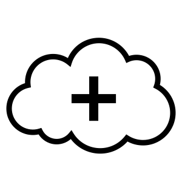

Contribution
============

This project started becauser we saw people rewrite the same
transformers and estimators at clients over and over again. Our
goal is to have a place where more experimental building blocks
for scikit learn pipelines might exist. This means we're usually
open to ideas to add here but there are a few things to keep in mind.

Before You Make a New Feature
-----------------------------

1. Discuss the feature and implementation you want to add on Github_ before you write a PR for it.
2. Features need a somewhat general usecase. If the usecase is very niche it will be hard for us to consider maintaining it.
3. If you're going to add a feature consider if you could help out in the maintenance of it.

When Writing a New Feature
--------------------------

When writing a new feauture there's some more details with regard to
how scikit learn likes to have it's parts implemented. We will display the a
sample implementation of the `RandomAdder` below.

.. code-block:: python

    from sklearn.base import BaseEstimator, TransformerMixin, MetaEstimatorMixin
    from sklearn.utils import check_array, check_X_y
    from sklearn.utils.validation import FLOAT_DTYPES, check_random_state, check_is_fitted

    from sklego.common import TrainOnlyTransformerMixin

    class RandomAdder(TrainOnlyTransformerMixin, BaseEstimator):
        def __init__(self, noise=1, random_state=None):
            self.noise = noise
            self.random_state = random_state

        def fit(self, X, y):
            super().fit(X, y)
            X, y = check_X_y(X, y, estimator=self, dtype=FLOAT_DTYPES)
            self.dim_ = X.shape[1]

            return self

        def transform_train(self, X):
            rs = check_random_state(self.random_state)
            check_is_fitted(self, ['dim_'])

            X = check_array(X, estimator=self, dtype=FLOAT_DTYPES)

            return X + rs.normal(0, self.noise, size=X.shape)

There's a few good practices we observe here that we'd appreciate
seeing in pull requests. We want to re-use features from sklearn as much as possible.
In particular, for this example:

1. We inherit from the mixins found in sklearn.
2. We use the validation utils from sklearn in our object to confirm if the model is fitted, if the array going into the model is of the correct type and if the random state is appropriate.

Feel free to look at example implementations before writing your own from scratch.

Unit Tests
----------

We write unit tests on these objects to make sure that they will work in a Pipeline_. This must
be guaranteed. To facilitate this we have some "standard" tests that will check things like "do
we change the shape of the input"? If your transformer belongs here: feel free to add it.

.. _Pipeline: https://scikit-learn.org/stable/modules/compose.html
.. _Github: https://github.com/koaning/scikit-lego/issues