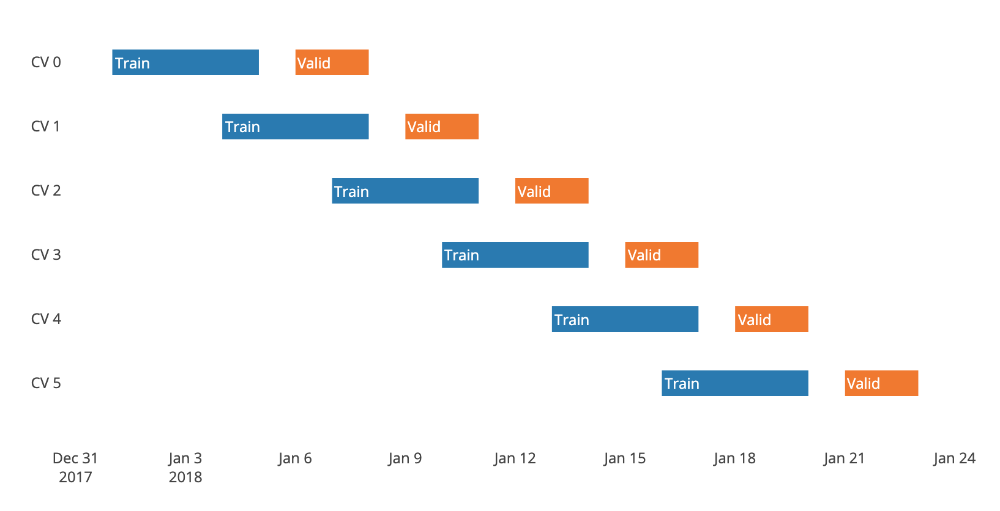

Time Gap Split Cross Validation
===============================

You would need TimeGapSplit:
- If you have multiple samples per timestamp: you want to make sure that a timestamp doesn’t appear at the same time in training and validation folds.
- If your target is looking x days ahead in the future. In this case you cannot construct the target of the last x days of your available data. It means that when you put your model in production, the first day that you are going to score is always x days after your last training sample, therefore you should select the best model according to that setup. In other words, if you keep that gap in the validation, your metric might be overestimated because those first x days might be easier to predict since they are closer to the training set. If you want to be strict in terms of robustness you might want to replicate in the CV exactly this real-world behaviour, and thus you want to introduce a gap of x days between your training and validation folds.

TimeGapSplit provides 3 parameters to really reproduce your production implementation in your cross-validation schema.

It uses a column parameter to specify the date used to split.
In case you have multiple rows per day (or per timestamp) this will make sure those rows in the same day
won't get split in different folds. This is a drawback of the original scikit-learn TimeSerieSplit that we fixed here.

Below a picture showing the all CVs with a gap.

Check the notebook for example and graph.

train_duration
**************
In the graph above in blue.

That represents the length of your rolling window used for in your feature generation.

validation_duration
*******************
In the graph above in red.

gap_duration
*******************
In the graph above in white between train and validation

This gap is a simulation of the fact that in production you are dropping the last forward looking window available,
i.e. there is alway 1 forward looking window between:

- the last day of your training sample on which you can create the target (which needs a forward looking window)
- and the first production sample scoring.

