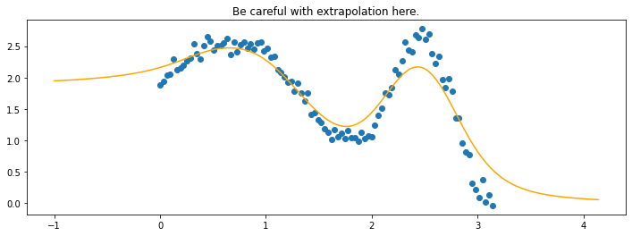
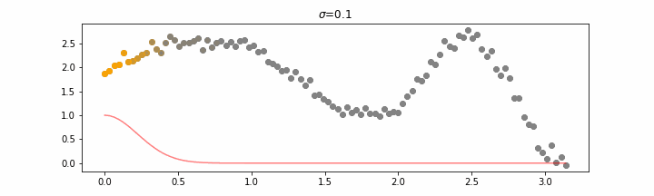
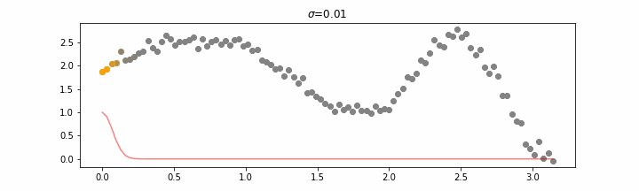
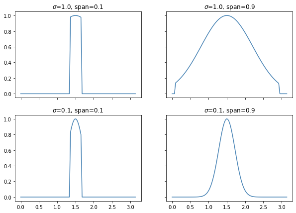
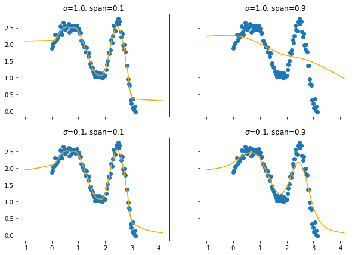

# Linear Models

There's a few linear models out there that we felt were generally useful. This
document will highlight some of them. 

## LOWESS: LOcally WEighted regreSSion

Lowess has historically been used for smoothing but you can also use it
for machine learning where you're interested in interpolating. Here's 
the common use-case. 

```python
import numpy as np
import matplotlib.pylab as plt
from sklego.linear_model import LowessRegression

n = 100
xs = np.linspace(0, np.pi, n)
ys = 1 + np.sin(xs) + np.cos(xs**2) + np.random.normal(0, 0.1, n)

mod = LowessRegression(sigma=0.1, span=0.5).fit(xs.reshape(-1, 1), ys)

xs_new = np.linspace(-1, np.pi + 1, n*2)
preds = mod.predict(xs_new.reshape(-1, 1))

plt.figure(figsize=(12, 4))
plt.scatter(xs, ys)
plt.plot(xs_new, preds, color='orange')
plt.title("Be careful with extrapolation here.");
```



The line does not look linear but that's because internally, during prediction,
many weighted linear regressions are happening. The gif below demonstrates how 
the data is being weighted when we would make a prediction. 



We'll also show two different prediction outcomes depending on the hyperparameter
`sigma`. 




You may be tempted now to think that a lower sigma always has a better fit, but you
need to be careful here. The data might have gaps. 

Note that this regression also works in higher dimensions but the main downside of 
this approach is that it is really slow when making predictions. 

If you really want to get advanced there's also a hyperparameter `span` but you'll
really need to know what you're doing. It was added for completeness but the authors 
of this package have yet to find a proper usecase for it. 

<details>
  <summary><b>Details on `span`.</b></summary>
  <br>
  The `span` parameter can be used to force that you'll only include a certain
  percentage of your dataset. Technically without a `span` you are still using
  all the data in your dataset, albeit with small weights if they are far away.
  
  The effect of the `span` parameter on the weights can be seen below.
  
  
  This will also effect the predictions.
   
  You may need to squint your eyes a bit to see it, but lower spans cause more 
  jiggles and less smooth curves.
</details>
<br>

