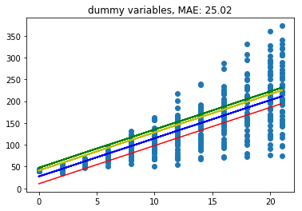
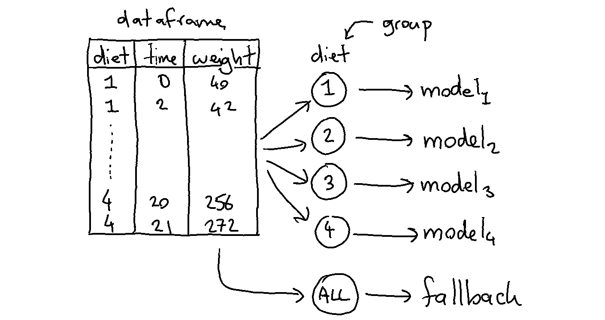
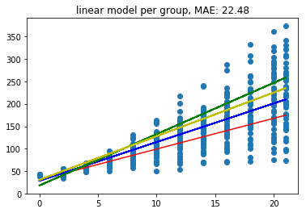
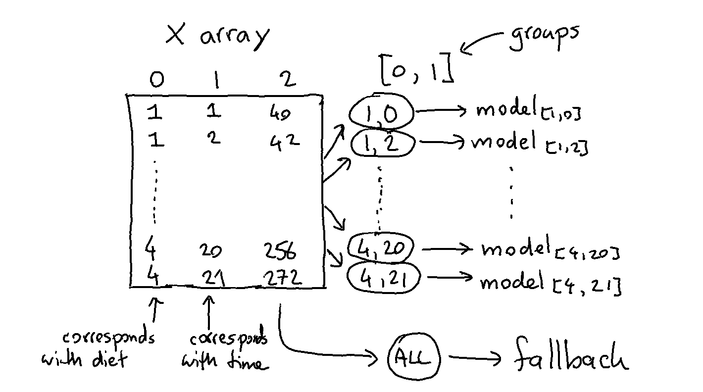
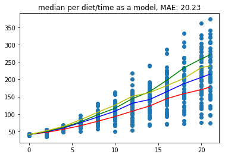

Meta Models
===========

Certain models in scikit-lego are "meta". Meta models are
models that depend on other estimators that go in and these
models will add features to the input model. One way of thinking
of a meta model is to consider it to be a way to "decorate" a
model.

This part of the documentation will highlight a few of them.

Grouped Estimation
------------------

A kind introduction to "meta"-models is the `GroupedEstimator`.

To help explain what it can do we'll consider three methods to predict
the chicken weight  . The chicken data has 578 rows and 4 columns
from an experiment on the effect of diet on early growth of chicks.
The body weights of the chicks were measured at birth and every second
day thereafter until day 20. They were also measured on day 21.
There were four groups on chicks on different protein diets.

Setup
*****

Let's first load a bunch of things to do this.

.. code-block:: python

    import numpy as np
    import pandas as pd
    import matplotlib.pylab as plt
    from sklearn.linear_model import LinearRegression
    from sklearn.pipeline import Pipeline, FeatureUnion
    from sklearn.preprocessing import OneHotEncoder, StandardScaler
    from sklearn.metrics import mean_absolute_error, mean_squared_error

    from sklego.datasets import load_chicken
    from sklego.preprocessing import ColumnSelector

    df = load_chicken(give_pandas=True)

    def plot_model(model):
        df = load_chicken(give_pandas=True)
        model.fit(df[['diet', 'time']], df['weight'])
        metric_df = df[['diet', 'time', 'weight']].assign(pred=lambda d: model.predict(d[['diet', 'time']]))
        metric = mean_absolute_error(metric_df['weight'], metric_df['pred'])
        plt.scatter(df['time'], df['weight'])
        for i in [1, 2, 3, 4]:
            pltr = metric_df[['time', 'diet', 'pred']].drop_duplicates().loc[lambda d: d['diet'] == i]
            plt.plot(pltr['time'], pltr['pred'], color='.rbgy'[i])
        plt.title(f"linear model per group, MAE: {np.round(metric, 2)}");

This code will be used to explain the steps below.

Model 1: Linear Regression with Dummies
***************************************

First we start with a baseline.

.. code-block:: python

    feature_pipeline = Pipeline([
        ("datagrab", FeatureUnion([
             ("discrete", Pipeline([
                 ("grab", ColumnSelector("diet")),
                 ("encode", OneHotEncoder(categories="auto", sparse=False))
             ])),
             ("continous", Pipeline([
                 ("grab", ColumnSelector("time")),
                 ("standardize", StandardScaler())
             ]))
        ]))
    ])

    pipe = Pipeline([
        ("transform", feature_pipeline),
        ("model", LinearRegression())
    ])

    plot_model(pipe)

This code results in a model that is plotted below.

Because the model is linear the dummy variable causes the intercept
to change but leaves the gradient untouched. This might not be what
we want from a model. So let's see how the grouped model can adress
this.

Model 2: Linear Regression in GroupedEstimation
***********************************************

The goal of the grouped estimator is to allow us to split up our data.
The image below demonstrates what will happen.

We train 5 models in total because the model will also train a
fallback automatically (you can turn this off via `use_fallback=False`).
The idea behind the fallback is that we can predict something if
the group does not appear in the prediction.

Each model will accept features that are in `X` that are not
part of the grouping variables. In this case each group will
model based on the `time` since `weight` is what we're trying
to predict.

Applying this model to the dataframe is easy.

.. code-block:: python

    from sklego.meta import GroupedEstimator
    mod = GroupedEstimator(LinearRegression(), groups=["diet"])
    plot_model(mod)

And the results will look a bit better.

Model 3: Dummy Regression in GroupedEstimation
**********************************************

We could go a step further and train a DummyRegressor_ per diet
per timestep. The code below works similar as the previous example
but one difference is that the grouped model does not receive a
dataframe but a numpy array.

Note that we're also grouping over more than one column here.
The code that does this is listed below.

.. code-block:: python

    from sklearn.dummy import DummyRegressor

    feature_pipeline = Pipeline([
        ("datagrab", FeatureUnion([
             ("discrete", Pipeline([
                 ("grab", ColumnSelector("diet")),
             ])),
             ("continous", Pipeline([
                 ("grab", ColumnSelector("time")),
             ]))
        ]))
    ])

    pipe = Pipeline([
        ("transform", feature_pipeline),
        ("model", GroupedEstimator(DummyRegressor(strategy="mean"), groups=[0, 1]))
    ])

    plot_model(pipe)

Again, we show the predictions:

Note that these predictions seems to yield the lowest error but take it
with a grain of salt since these errors are only based on the train set.

.. _DummyRegressor: https://scikit-learn.org/stable/modules/generated/sklearn.dummy.DummyRegressor.html