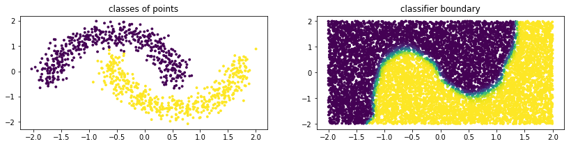
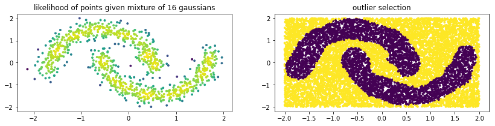
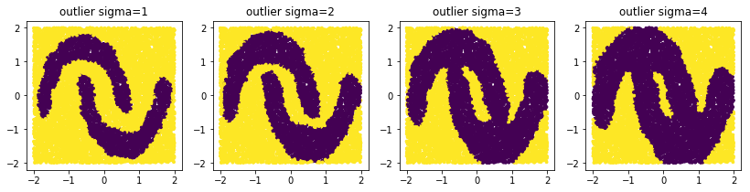
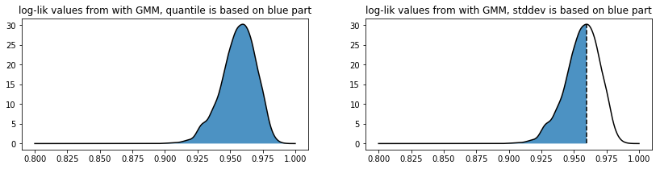

Mixture Methods
===============

Gaussian Mixture Models (GMMs) are flexible building blocks for other
machine learning algorithms. This is in part because they are
great approximations for general probability distributions but
also because they remain somewhat interpretable even when the
dataset gets very complex. This package makes use of GMMs to construct
other algorithms.

Classification
--------------

Below is some example code of how you might use a GMM
from sklego to perform classification.

.. testcode:: python

    import numpy as np
    import matplotlib.pylab as plt

    from sklearn.datasets import make_moons
    from sklearn.preprocessing import StandardScaler

    from sklego.mixture import GMMClassifier

    n = 1000
    X, y = make_moons(n)
    X = X + np.random.normal(n, 0.12, (n, 2))
    X = StandardScaler().fit_transform(X)
    U = np.random.uniform(-2, 2, (10000, 2))

    mod = GMMClassifier(n_components=4).fit(X, y)

    plt.figure(figsize=(14, 3))
    plt.subplot(121)
    plt.scatter(X[:, 0], X[:, 1], c=mod.predict(X), s=8)
    plt.title("classes of points");

    plt.subplot(122)
    plt.scatter(U[:, 0], U[:, 1], c=mod.predict_proba(U)[:, 1], s=8)
    plt.title("classifier boundary");

Outlier Detection
-----------------

Below is some example code of how you might use a GMM
from sklego to do outlier detection.

.. testcode:: python

    import numpy as np
    import matplotlib.pylab as plt

    from sklearn.datasets import make_moons
    from sklearn.preprocessing import StandardScaler

    from sklego.mixture import GMMOutlierDetector

    n = 1000
    X = make_moons(n)[0] + np.random.normal(n, 0.12, (n, 2))
    X = StandardScaler().fit_transform(X)
    U = np.random.uniform(-2, 2, (10000, 2))

    mod = GMMOutlierDetector(n_components=16, threshold=0.95).fit(X)

    plt.figure(figsize=(14, 3))
    plt.subplot(121)
    plt.scatter(X[:, 0], X[:, 1], c=mod.score_samples(X), s=8)
    plt.title("likelihood of points given mixture of 16 gaussians");

    plt.subplot(122)
    plt.scatter(U[:, 0], U[:, 1], c=mod.predict(U), s=8)
    plt.title("outlier selection")

Note that with a GMM there are multiple ways to select outliers. Instead
of selection points that are beyond the likely quantile threshold one
can also specify the number of standard deviations away from the most likely
standard deviations a given point it.

.. testcode:: python

    plt.figure(figsize=(14, 3))
    for i in range(1, 5):
        mod = GMMOutlierDetector(n_components=16, threshold=i, method="stddev").fit(X)
        plt.subplot(140 + i)
        plt.scatter(U[:, 0], U[:, 1], c=mod.predict(U), s=8)
        plt.title(f"outlier sigma={i}");

Detection Details
-----------------

The outlier detection methods that we use are based on the likelihoods
that come out of the estimated Gaussian Mixture. Depending on the setting
you choose we have a different method for determining if a point is inside
or outside the threshold.

1. If the "quantile" method is used we take all the likelihood scores
   found that the GMM associates on a training dataset to determine where
   to set a threshold. The threshold value must be between 0 and 1 here.
2. If the "stddev" method is used then the threshold value is now interpreted
   as the number of standard deviations lower than the mean we are. We only
   calculate the standard deviation on the lower scores because there's usually
   more variance here. Note that this setting allows you to be much more picky
   in selecting than the "quantile" setting since this method allows you to be
   more exclusive than the "quantile" method with threshold equal to one.

As a sidenote: this image was generated with some dummy data, but its code can be found below.

.. testcode:: python

    import numpy as np
    import matplotlib.pylab as plt
    from scipy.stats import gaussian_kde

    score_samples = np.random.beta(220, 10, 3000)
    density = gaussian_kde(score_samples)
    likelihood_range = np.linspace(0.80, 1.0, 10000)

    index_max_y = np.argmax(density(likelihood_range))
    mean_likelihood = likelihood_range[index_max_y]
    new_likelihoods = score_samples[score_samples < mean_likelihood]
    new_likelihoods_std = np.sqrt(np.sum((new_likelihoods - mean_likelihood) ** 2)/(len(new_likelihoods) - 1))

    plt.figure(figsize=(14, 3))
    plt.subplot(121)
    plt.plot(likelihood_range, density(likelihood_range), 'k')
    xs = np.linspace(0.8, 1.0, 2000)
    plt.fill_between(xs, density(xs), alpha=0.8)
    plt.title("log-lik values from with GMM, quantile is based on blue part");

    plt.subplot(122)
    plt.plot(likelihood_range, density(likelihood_range), 'k')
    plt.plot([mean_likelihood, mean_likelihood], [0, density(mean_likelihood)], 'k--')
    xs = np.linspace(0.8, mean_likelihood, 2000)
    plt.fill_between(xs, density(xs), alpha=0.8)
    plt.title("log-lik values from with GMM, stddev is based on blue part");