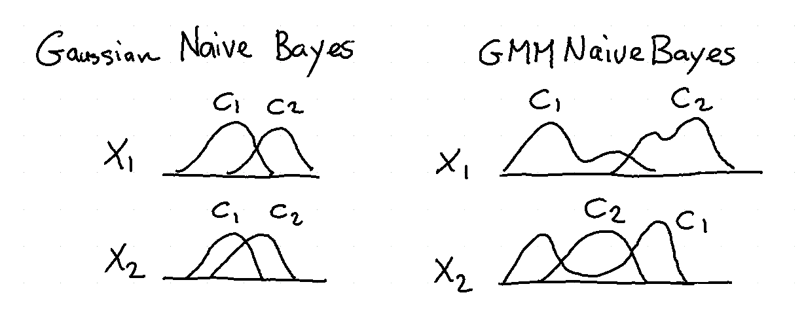
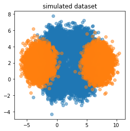
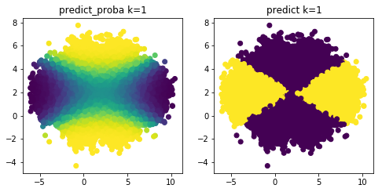
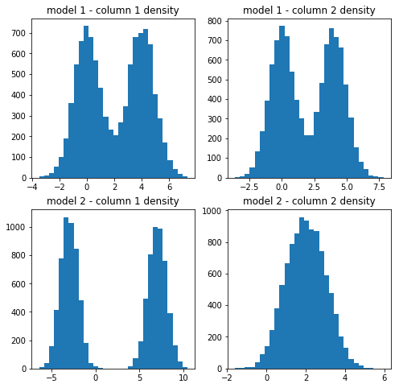

Naive Bayes
===========

Naive Bayes models are flexible and interpretable. In scikit
lego we've added support for a Gaussian Mixture variant of
the algorithm.

An example of this algorithm can be found below.

.. code-block:: python

    import numpy as np
    import matplotlib.pylab as plt
    from sklego.naive_bayes import GaussianMixtureNBn = 10000

    def make_arr(mu1, mu2, std1=1, std2=1, p=0.5):
        res = np.where(np.random.uniform(0, 1, n) > p,
                       np.random.normal(mu1, std1, n),
                       np.random.normal(mu2, std2, n));
        return np.expand_dims(res, 1)

    np.random.seed(42)
    X1 = np.concatenate([make_arr(0, 4), make_arr(0, 4)], axis=1)
    X2 = np.concatenate([make_arr(-3, 7), make_arr(2, 2)], axis=1)

    plt.figure(figsize=(4,4))
    plt.scatter(X1[:, 0], X1[:, 1], alpha=0.5)
    plt.scatter(X2[:, 0], X2[:, 1], alpha=0.5)
    plt.title("simulated dataset");

.. code-block:: python

    X = np.concatenate([X1, X2])
    y = np.concatenate([np.zeros(n), np.ones(n)])
    for i, k in enumerate([1, 2]):
        mod = GaussianMixtureNB(n_components=k).fit(X, y)
        plt.figure(figsize=(8, 8))
        plt.subplot(220 + i * 2 + 1)
        pred = mod.predict_proba(X)[:, 0]
        plt.scatter(X[:, 0], X[:, 1], c=pred)
        plt.title(f"predict_proba k={k}");

        plt.subplot(220 + i * 2 + 2)
        pred = mod.predict(X)
        plt.scatter(X[:, 0], X[:, 1], c=pred)
        plt.title(f"predict k={k}");

.. code-block:: python

    gmm1 = mod.gmms_[0.0]
    gmm2 = mod.gmms_[1.0]
    plt.figure(figsize=(8, 8))

    plt.subplot(221)
    plt.hist(gmm1[0].sample(n)[0], 30)
    plt.title("model 1 - column 1 density")
    plt.subplot(222)
    plt.hist(gmm1[1].sample(n)[0], 30)
    plt.title("model 1 - column 2 density")
    plt.subplot(223)
    plt.hist(gmm2[0].sample(n)[0], 30)
    plt.title("model 2 - column 1 density")
    plt.subplot(224)
    plt.hist(gmm2[1].sample(n)[0], 30)
    plt.title("model 2 - column 2 density");

