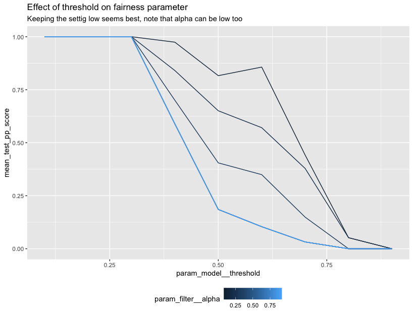
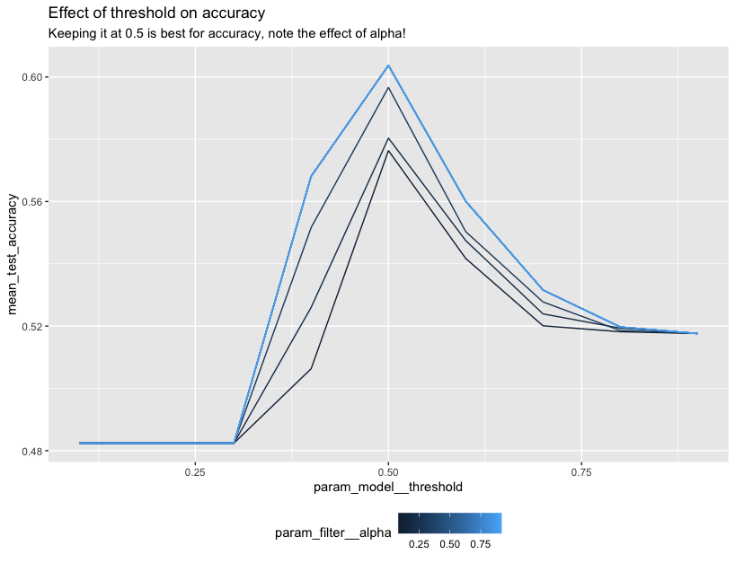

# Lego in Rstudio

Thanks to [reticulate](https://github.com/rstudio/reticulate) you 
can also use this package from R. We couldn't find any good documentation
on how to build a proper scikit-learn gridsearch using reticulate so
we figured we might add a resource to our documentation here.

It should be said that we feel that the best developer experience
is definately going to be in python but we figured it be helpful
to put a small example in our documentation. 

## Demo 

You'll first need to install a dependency and set up a link to a 
python virtualenv that has scikit-lego already installed.

```r
install.packages("reticulate")

# optionally you can install miniconda 
# reticulate::install_miniconda()

library(reticulate)
library(tidyverse)

# again optionally if you're using miniconda
# use_condaenv("r-reticulate")
py_discover_config()
```

You can read more details about this on the [reticulate docs on installation](https://rstudio.github.io/reticulate/articles/versions.html)
as well as [their docs on package management](https://rstudio.github.io/reticulate/articles/python_packages.html).

From here you can start importing the python dependencies from R. 

```r
sklearn <- import("sklearn")
sklego <- import("sklego")

info_filter <- sklego$preprocessing$InformationFilter
thresholder <- sklego$meta$Thresholder
pp_score    <- sklego$metrics$p_percent_score

lr          <- sklearn$linear_model$LogisticRegression
pipeline    <- sklearn$pipeline$Pipeline
grid        <- sklearn$model_selection$GridSearchCV
make_scorer <- sklearn$metrics$make_scorer
accuracy    <- sklearn$metrics$accuracy_score
```

We can also setup a scikit-learn pipeline. 

```r
pipe <- pipeline(
  c(
    tuple("filter", info_filter(columns = c("colour"), alpha=0.9)),
    tuple("model", thresholder(model = lr(), threshold = 0.5))
  )
)
```

Note that this pipeline contains two specific tools from the lego library. 

- the [information filter](https://scikit-lego.readthedocs.io/en/latest/api/preprocessing.html#sklego.preprocessing.InformationFilter)
- the [thresholder meta model](https://scikit-lego.readthedocs.io/en/latest/api/meta.html#sklego.meta.Thresholder)

We can even load in some datasets. 

```r
df <- sklego$datasets$load_arrests(give_pandas = TRUE)

X <- df %>% select(year, age, colour)
X['colour'] <- as.numeric(X['colour'] == "Black")
y <- as.numeric(df$checks > 1)
```

In this case we're taking a subset of the `load_arrests` dataset. This information
contains arrests data and we're going to perform gridsearch keeping fairness in mind. 

```r
cv <- grid(
  estimator = pipe, 
  param_grid = list("filter__alpha"=seq(0.1, 0.9, 0.1), 
                    "model__threshold"=seq(0.1, 0.9, 0.1)),
  cv=as.integer(3),
  scoring = list(accuracy=make_scorer(accuracy), 
                 pp_score=pp_score('colour')),
  refit="accuracy")

cv$fit(X, y)
```

You'll note that we're using `list` and `as.integer` here. For details on why, 
check out this [documentation page]().

We'll need to do some parsing of the `cv_results_` to properly get these into a tidyverse dataframe. 

```r
cv_df <- cv$cv_results_ %>% 
  as_tibble() %>% 
  select(param_filter__alpha, param_model__threshold, mean_test_pp_score, mean_test_accuracy) %>% 
  mutate(param_filter__alpha = unlist(param_filter__alpha),
         param_model__threshold = unlist(param_model__threshold))
```

But from here we can do some plotting. 

```r
ggplot(data=cv_df) +
  geom_line(aes(param_model__threshold, mean_test_accuracy, 
                group=param_filter__alpha, color=param_filter__alpha)) +
  ggtitle("Effect of threshold on accuracy",
          subtitle="Keeping it at 0.5 is best for accuracy, note the effect of alpha!") + 
  theme(legend.position="bottom")
```



```r
ggplot(data=cv_df) +
  geom_line(aes(param_model__threshold, mean_test_pp_score, 
                group=param_filter__alpha, color=param_filter__alpha)) +
  ggtitle("Effect of threshold on fairness parameter",
        subtitle="For fairness we want to maybe not use 0.5") + 
  theme(legend.position="bottom")
```



## Important 

Note that we're mainly trying to demonstrate the R api here. In terms of fairness you 
would want to explore the dataset further before you say anything conclusive.

Also, it may be simpler and more preferential to use the [python engine](https://rstudio.github.io/reticulate/articles/r_markdown.html)
inside of R-markdown instead of translating R-datastructures to python ones manually. 
But you can certainly combine the tools from scikit-lego with your tools in R.