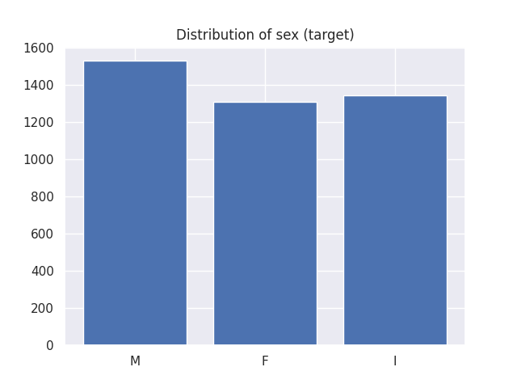
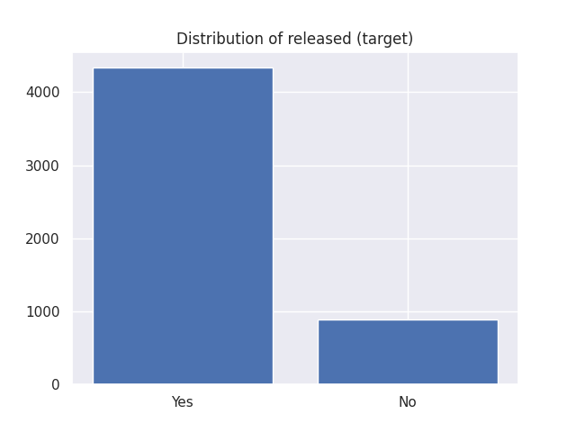
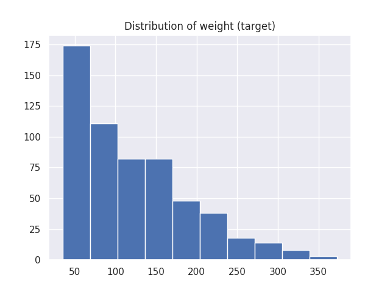
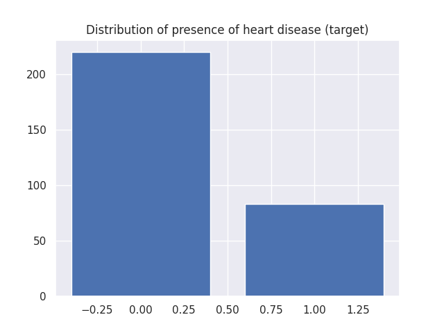
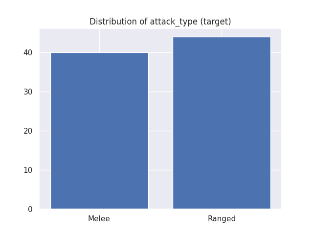
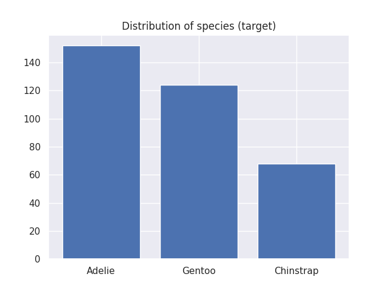
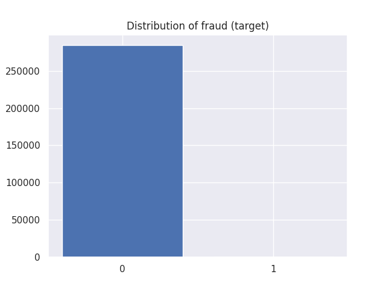
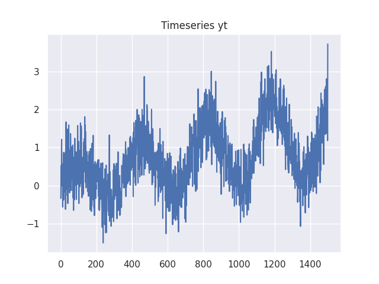

# Datasets

Scikit-lego includes several datasets which can be used for testing purposes. Each dataset has different options for returning the data:

- When setting `as_frame=True` the data, including the target, is returned as a (pandas) dataframe.
- When setting `return_X_y=True` the data is returned directly as `(data, target)` instead of a dict object.

This notebook describes the different sets included in Scikit-lego:

- [`sklego.datasets.load_abalone`][abalone-api] loads in the abalone dataset
- [`sklego.datasets.load_arrests`][arrests-api] loads in a dataset with fairness concerns
- [`sklego.datasets.load_chicken`][chicken-api] loads in the joyful chickweight dataset
- [`sklego.datasets.load_heroes`][heroes-api] loads a heroes of the storm dataset
- [`sklego.datasets.load_hearts`][hearts-api] loads a dataset about hearts
- [`sklego.datasets.load_penguins`][penguins-api] loads a lovely dataset about penguins
- [`sklego.datasets.fetch_creditcard`][fetch_creditcard-api] fetch a fraud dataset from openml
- [`sklego.datasets.make_simpleseries`][make_simpleseries-api] make a simulated timeseries

## Imports

Loads necessary imports used in rest of the code snippets.

```py
--8<-- "docs/_scripts/datasets.py:imports"
```

## Abalone

Loads the abalone dataset where the goal is to predict the gender of the creature.

```py
--8<-- "docs/_scripts/datasets.py:load-abalone"
```

--8<-- "docs/_static/datasets/abalone.md"

```py
--8<-- "docs/_scripts/datasets.py:plot-abalone"
```



## Arrests

Loads the arrests dataset which can serve as a benchmark for *fairness*.

It is data on the police treatment of individuals arrested in Toronto for simple possession of small quantities of marijuana.

The goal is to predict whether or not the arrestee was released with a summons while maintaining a degree of fairness.

```py
--8<-- "docs/_scripts/datasets.py:load-arrests"
```

--8<-- "docs/_static/datasets/arrests.md"

```py
--8<-- "docs/_scripts/datasets.py:plot-arrests"
```



## Chickens

Loads the chicken dataset. The data has 578 rows and 4 columns from an experiment on the effect of diet on early growth of chicks.

The body weights of the chicks were measured at birth and every second day thereafter until day 20. They were also measured on day 21.

There were four groups on chicks on different protein diets.

```py
--8<-- "docs/_scripts/datasets.py:load-chicken"
```

--8<-- "docs/_static/datasets/chicken.md"

```py
--8<-- "docs/_scripts/datasets.py:plot-chicken"
```



## Hearts

Loads the Cleveland Heart Diseases dataset. The goal is to predict the presence of a heart disease (target values 1, 2, 3, and 4).

The data originates from research to heart diseases by four institutions and originally contains 76 attributes.
Yet, all published experiments refer to using a subset of 13 features and one target.

This implementation loads the Cleveland dataset of the research which is the only set used by ML researchers to this date.

```py
--8<-- "docs/_scripts/datasets.py:load-hearts"
```

--8<-- "docs/_static/datasets/hearts.md"

```py
--8<-- "docs/_scripts/datasets.py:plot-hearts"
```



## Heroes

A dataset from the video game [Heroes of the storm][heroes].

The goal of the dataset is to predict the attack type.

Note that the pandas dataset returns more information.

```py
--8<-- "docs/_scripts/datasets.py:load-heroes"
```

--8<-- "docs/_static/datasets/heroes.md"

```py
--8<-- "docs/_scripts/datasets.py:plot-heroes"
```



## Penguins

Loads the penguins dataset, which is a lovely alternative for the iris dataset.
We"ve added this dataset for educational use.

Data were collected and made available by Dr. Kristen Gorman and the Palmer Station, Antarctica LTER, a member of the Long Term Ecological Research Network.

The goal of the dataset is to predict which species of penguin a penguin belongs to.

```py
--8<-- "docs/_scripts/datasets.py:load-penguins"
```

--8<-- "docs/_static/datasets/penguins.md"

```py
--8<-- "docs/_scripts/datasets.py:plot-penguins"
```



## Creditcard frauds

Loads the creditcard dataset. Downloads it if necessary.

Note that internally this is using [`sklearn.datasets.fetch_openml`][fetch-openml-api], which is experimental.

```console
==============   ==============
Samples total            284807
Dimensionality               29
Features                   real
Target                 int 0, 1
==============   ==============
```

The datasets contains transactions made by credit cards in September 2013 by european cardholders.
This dataset present transactions that occurred in two days, where we have 492 frauds out of 284,807 transactions.

The dataset is highly unbalanced, the positive class (frauds) account for 0.172% of all transactions.

**Please cite**:
    ```
    Andrea Dal Pozzolo, Olivier Caelen, Reid A. Johnson and Gianluca Bontempi.
    Calibrating Probability with Undersampling for Unbalanced Classification.
    In Symposium on Computational Intelligence and Data Mining (CIDM), IEEE, 2015
    ```

```py
--8<-- "docs/_scripts/datasets.py:load-creditcards"
```

--8<-- "docs/_static/datasets/creditcards.md"

```py
--8<-- "docs/_scripts/datasets.py:plot-creditcards"
```



## Simpleseries

Generate a *very simple* timeseries dataset to play with. The generator assumes to generate daily data with a season, trend and noise.

```py
--8<-- "docs/_scripts/datasets.py:load-ts"
```

--8<-- "docs/_static/datasets/timeseries.md"

```py
--8<-- "docs/_scripts/datasets.py:plot-ts"
```



[abalone-api]: /api/datasets#sklego.datasets.load_abalone
[arrests-api]: /api/datasets#sklego.datasets.load_arrests
[chicken-api]: /api/datasets#sklego.datasets.load_chicken
[heroes-api]: /api/datasets#sklego.datasets.load_heroes
[hearts-api]: /api/datasets#sklego.datasets.load_hearts
[penguins-api]: /api/datasets#sklego.datasets.load_penguins
[fetch_creditcard-api]: /api/datasets#sklego.datasets.fetch_creditcard
[make_simpleseries-api]: /api/datasets#sklego.datasets.make_simpleseries

[heroes]: https://heroesofthestorm.blizzard.com/en-us/
[fetch-openml-api]: https://scikit-learn.org/stable/modules/generated/sklearn.datasets.fetch_openml.html
