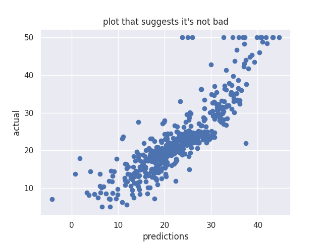
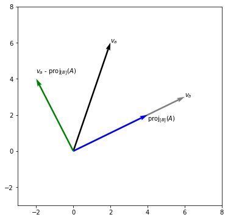
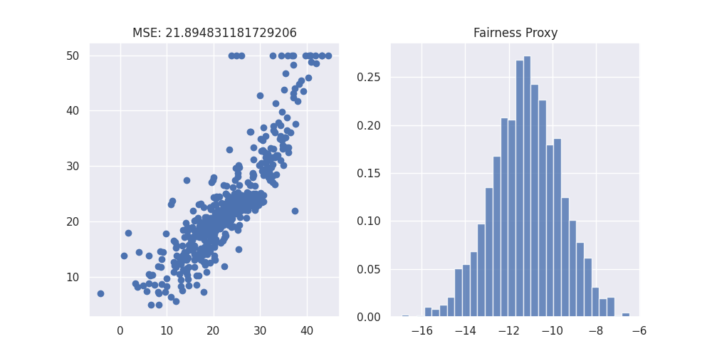
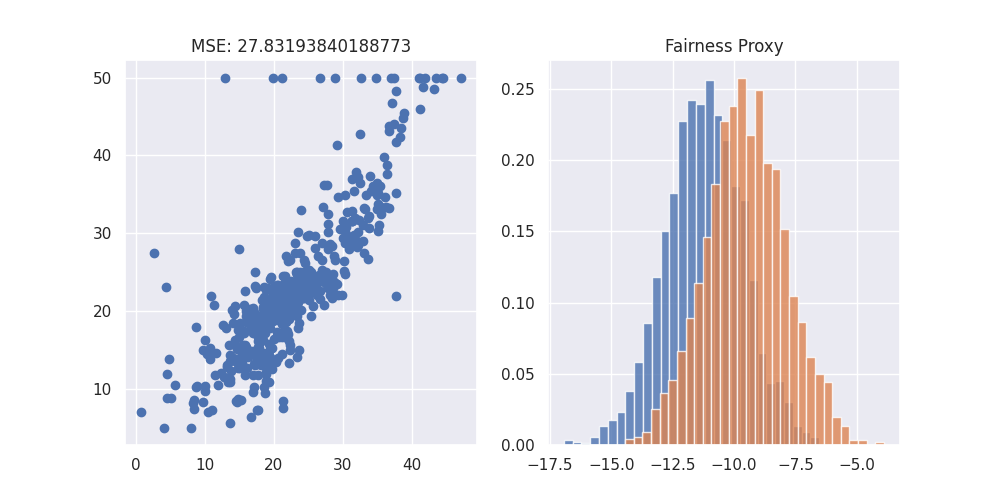
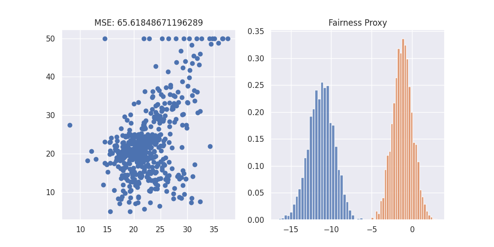
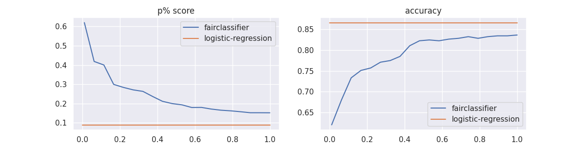
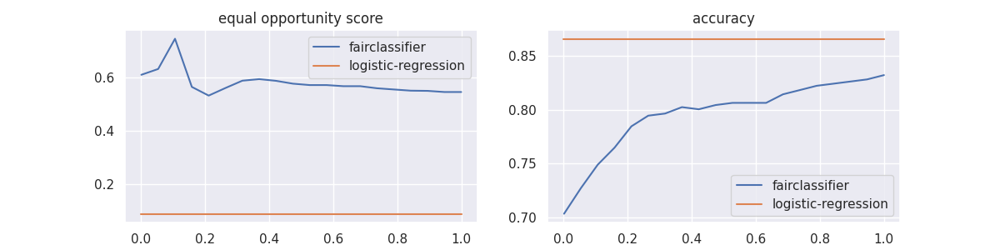

# Fairness

!!! tip
    For a more comprehensive guide on fairness, we suggest to checkout the
    [fairlearn library](https://fairlearn.org/) and its [user guide](https://fairlearn.org/v0.12/user_guide/index.html).

Scikit learn (pre version 1.2) came with the boston housing dataset. We can make a simple pipeline with it and make us a small model. We can even write the code to also make a plot that can convince us that we're doing well:

```py title="Predict Boston housing dataset"
--8<-- "docs/_scripts/fairness.py:predict-boston-simple"
```



We could stop our research here if we think that our MSE is _good enough_ but this would be _dangerous_. To find out why, we should look at the variables that are being used in our model.

```py title="Boston housing dataset"
--8<-- "docs/_scripts/fairness.py:print-boston"
```

!!! info "Boston housing description"
    ```
    --8<-- "docs/_static/fairness/boston-description.txt"
    ```

This dataset contains features like "lower status of population" and "the proportion of blacks by town".

!!! danger
    This is bad! There's a real possibility that our model will overfit on MSE and underfit on fairness when we want to apply it. Scikit-Lego has some support to deal with fairness issues like this one.

Dealing with issues such as fairness in machine learning can in general be done in three ways:

- Data preprocessing
- Model constraints
- Prediction postprocessing

Before we can dive into methods for getting more fair predictions, we first need to define how to measure fairness.

## Measuring fairness for Regression

Measuring fairness can be done in many ways but we'll consider one definition: the output of the model is fair with regards to groups $A$ and $B$ if prediction has a distribution independent of group $A$ or $B$.

In laymans terms: if group $A$ and $B$ don't get the same predictions: no bueno.

Formally, how much the _means_ of the distributions differ can be written as:

$$fairness = \left\lvert \frac{1}{|Z_1|} \sum_{i \in Z_1} \hat{y}_{i} - \frac{1}{|Z_0|} \sum_{j \in Z_0} \hat{y}_{j} \right\rvert$$

where $Z_1$ is the subset of the population where our sensitive attribute is true, and $Z_0$ the subset of the population where the sensitive attribute is false.

To estimate this we'll use bootstrap sampling to measure the models bias.

## Measuring fairness for Classification

A common method for measuring fairness is demographic parity[^1], for example through the p-percent metric.

The idea is that a decision — such as accepting or denying a loan application — ought to be independent of the protected attribute.
In other words, we expect the __positive__ rate in both groups to be the same. In the case of a binary decision $\hat{y}$
and a binary protected attribute $z$, this constraint can be formalized by asking that

$$P(\hat{y}=1 | z=0)=P(\hat{y}=1 | z=1)$$

You can turn this into a metric by calculating how far short the decision process falls of this exact equality. This metric is called the **p% score**

$$\text{p% score} = \min \left(\frac{P(\hat{y}=1 | z=1)}{P(\hat{y}=1 | z=0)}, \frac{P(\hat{y}=1 | z=0)}{P(\hat{y}=1 | z=1)}\right)$$

In other words, membership in a protected class should have no correlation with the decision.

In `sklego` this metric is implemented in as [`p_percent_score`][p-percent-score-api] and it works as follows:

```py title="p% score"
--8<-- "docs/_scripts/fairness.py:p-percent-score"
```

> p_percent_score: 0

Of course, no metric is perfect. If, for example, we used this in a loan approval situation the demographic parity only looks at loans made and not at the rate at which loans are repaid.

That might result in a lower percentage of qualified people who are given loans in one population than in another. Another way of measuring fairness could therefore be to measure equal opportunity[^2], implemented in `sklego` as [`equal_opportunity_score`][equal-opportunity-score-api]. This constraint would boil down to:

$$P(\hat{y}=1 | z=0, y=1)=P(\hat{y}=1 | z=1, y=1)$$

and be turned into a metric in the same way as above:

$$\text{equality of opportunity} = \min \left(\frac{P(\hat{y}=1 | z=1, y=1)}{P(\hat{y}=1 | z=0, y=1)}, \frac{P(\hat{y}=1 | z=0, y=1)}{P(\hat{y}=1 | z=1, y=1)}\right)$$

We can see in the example below that the equal opportunity score does not differ for the models as long as the records where `y_true = 1` are predicted correctly.

```py title="equality opportunity score"
--8<-- "docs/_scripts/fairness.py:equal-opportunity-score"
```

```console
equal_opportunity_score: 0.75
equal_opportunity_score: 0.75
equal_opportunity_score: 0.0
```

## Data preprocessing

When doing data preprocessing we're trying to remove any bias caused by the sensitive variable from the input dataset. By doing this, we remain flexible in our choice of models.

### Information Filter

This is a great opportunity to use the [`InformationFilter`][filter-information-api] which can filter the information of these two sensitive columns away as a transformation step.

It does this by projecting all vectors away such that the remaining dataset is orthogonal to the sensitive columns.

#### How it works

The [`InformationFilter`][filter-information-api] uses a variant of the [Gram–Schmidt process][gram–schmidt-process] to filter information out of the dataset. We can make it visual in two dimensions;



To explain what occurs in higher dimensions we need to resort to maths. Take a training matrix $X$ that contains columns $x_1, ..., x_k$.

If we assume columns $x_1$ and $x_2$ to be the sensitive columns then the information filter will filter out information using the following approach:

$$
\begin{split}
v_1 & = x_1 \\
v_2 & = x_2 - \frac{x_2 v_1}{v_1 v_1}\\
v_3 & = x_3 - \frac{x_3 v_1}{v_1 v_1} - \frac{x_3 v_2}{v_2 v_2}\\
    & ... \\
v_k & = x_k - \frac{x_k v_1}{v_1 v_1} - \frac{x_k' v_2}{v_2 v_2}
\end{split}
$$

Concatenating our vectors (but removing the sensitive ones) gives us a new training matrix $X_{\text{more fair}} =  [v_3, ..., v_k]$.

#### Experiment

We will demonstrate the effect of applying this by benchmarking three things:

1. Keep $X$ as is.
2. Drop the two columns that are sensitive.
3. Use the information filter

We'll use the regression metric defined above to show the differences in fairness.

```py title="Information Filter"
--8<-- "docs/_scripts/fairness.py:information-filter"
```

We can see that the coefficients of the three models are indeed different.

```py title="Information Filter"
--8<-- "docs/_scripts/fairness.py:information-filter-coefs"
```

--8<-- "docs/_static/fairness/information-filter-coefs.md"

??? example "Utils"
    ```py
    --8<-- "docs/_scripts/fairness.py:utils"
    ```

#### 1. Original Situation

??? example "Code to generate the plot"
    ```py
    --8<-- "docs/_scripts/fairness.py:original-situation"
    ```


#### 2. Drop two columns

??? example "Code to generate the plot"
    ```py
    --8<-- "docs/_scripts/fairness.py:drop-two"
    ```


#### 3. Use the Information Filter

??? example "Code to generate the plot"
    ```py
    --8<-- "docs/_scripts/fairness.py:use-info-filter"
    ```


There definitely is a balance between fairness and model accuracy. Which model you'll use depends on the world you want to create by applying your model.

Note that you can combine models here to make an ensemble too. You can also use the difference between the first and last model as a proxy for bias.

## Model constraints

Another way we could tackle this fairness problem would be to explicitly take fairness into account when optimizing the parameters of our model. This is implemented in the [`DemographicParityClassifier`][demographic-parity-api] as well as the [`EqualOpportunityClassifier`][equal-opportunity-api].

Both these models are built as an extension of basic logistic regression. Where logistic regression optimizes the following problem:

$$
\begin{array}{cl}
{\operatorname{minimize}} & -\sum_{i=1}^{N} \log p\left(y_{i} | \mathbf{x}_{i},\boldsymbol{\theta}\right)
\end{array}
$$

We would like to instead optimize this:

$$
\begin{array}{cl}
{\operatorname{minimize}} & -\sum_{i=1}^{N} \log p\left(y_{i} | \mathbf{x}_{i}, \boldsymbol{\theta}\right) \\
{\text { subject to }} & \text{fairness} \geq \mathbf{c}
\end{array}
$$

## Demographic Parity Classifier

The p% score discussed above is a nice metric but unfortunately it is rather hard to directly implement in the formulation into our model as it is a non-convex function making it difficult to optimize directly. Also, as the p% rule only depends on which side of the decision boundary an observation lies, it is invariant in small changes in the decision boundary. This causes large saddle points in the objective making optimization even more difficult

Instead of optimizing for the p% directly, we approximate it by taking the covariance between the users’ sensitive
attributes, $z$m, and the decision boundary. This results in the following formulation of our [`DemographicParityClassifier`][demographic-parity-api].

$$
\begin{array}{cl}
{\operatorname{minimize}} & -\sum_{i=1}^{N} \log p\left(y_{i} | \mathbf{x}_{i}, \boldsymbol{\theta}\right)\\
{\text { subject to }} & {\frac{1}{N} \sum_{i=1}^{N}\left(\mathbf{z}_{i}-\overline{\mathbf{z}}\right)
d_\boldsymbol{\theta}\left(\mathbf{x}_{i}\right) \leq \mathbf{c}} \\
{} & {\frac{1}{N} \sum_{i=1}^{N}\left(\mathbf{z}_{i}-\overline{\mathbf{z}}\right)
d_{\boldsymbol{\theta}}\left(\mathbf{x}_{i}\right) \geq-\mathbf{c}}
\end{array}
$$

Let's see what the effect of this is. As this is a Classifier and not a Regressor, we transform the target to a binary variable indicating whether it is above or below the median. Our p% metric also assumes a binary indicator for sensitive columns so we do the same for our `lstat` column.

Fitting the model is as easy as fitting a normal sklearn model. We just need to supply the columns that should be treated as sensitive to the model, as well as the maximum covariance we want to have.

```py title="Demographic Parity Classifier"
--8<-- "docs/_scripts/fairness.py:demographic-parity"
```

Comparing the two models on their p% scores also shows that the fair classifier has a much higher fairness score at a slight cost in accuracy.

We'll compare these two models by doing a gridsearch on the effect of the `covariance_threshold`.

```py
--8<-- "docs/_scripts/fairness.py:demographic-parity-grid"
```

The results of the grid search are shown below. Note that the logistic regression results are of the train set, not the test set. We can see that the increase in fairness comes at the cost of accuracy but this might literally be a fair tradeoff.

??? example "Code to generate the plot"
    ```py
    --8<-- "docs/_scripts/fairness.py:demographic-parity-grid-results"
    ```


## Equal opportunity

In the same spirit as the `DemographicParityClassifier` discussed above, there is also an [`EqualOpportunityClassifier`][equal-opportunity-api] which optimizes

$$
\begin{array}{cl}
{\operatorname{minimize}} & -\sum_{i=1}^{N} \log p\left(y_{i} | \mathbf{x}_{i}, \boldsymbol{\theta}\right) \\
{\text { subject to }} & {\frac{1}{POS} \sum_{i=1}^{POS}\left(\mathbf{z}_{i}-\overline{\mathbf{z}}\right)
d_\boldsymbol{\theta}\left(\mathbf{x}_{i}\right) \leq \mathbf{c}} \\
{} & {\frac{1}{POS} \sum_{i=1}^{POS}\left(\mathbf{z}_{i}-\overline{\mathbf{z}}\right)
d_{\boldsymbol{\theta}}\left(\mathbf{x}_{i}\right) \geq-\mathbf{c}}
\end{array}
$$

where POS is the subset of the population where `y_true = positive_target`.

```py title="Equal Opportunity Classifier"
--8<-- "docs/_scripts/fairness.py:equal-opportunity-grid"
```

??? example "Code to generate the plot"
    ```py
    --8<-- "docs/_scripts/fairness.py:equal-opportunity-grid-results"
    ```


[^1]: M. Zafar et al. (2017), Fairness Constraints: Mechanisms for Fair Classification
[^2]: M. Hardt, E. Price and N. Srebro (2016), Equality of Opportunity in Supervised Learning

[p-percent-score-api]: ../../api/metrics#sklego.metrics.p_percent_score
[equal-opportunity-score-api]: ../../api/metrics#sklego.metrics.equal_opportunity_score
[filter-information-api]: ../../api/preprocessing#sklego.preprocessing.projections.InformationFilter
[demographic-parity-api]: ../../api/linear_model#sklego.linear_model.DemographicParityClassifier
[equal-opportunity-api]: ../../api/linear_model#sklego.linear_model.EqualOpportunityClassifier

[gram–schmidt-process]: https://en.wikipedia.org/wiki/Gram%E2%80%93Schmidt_process
