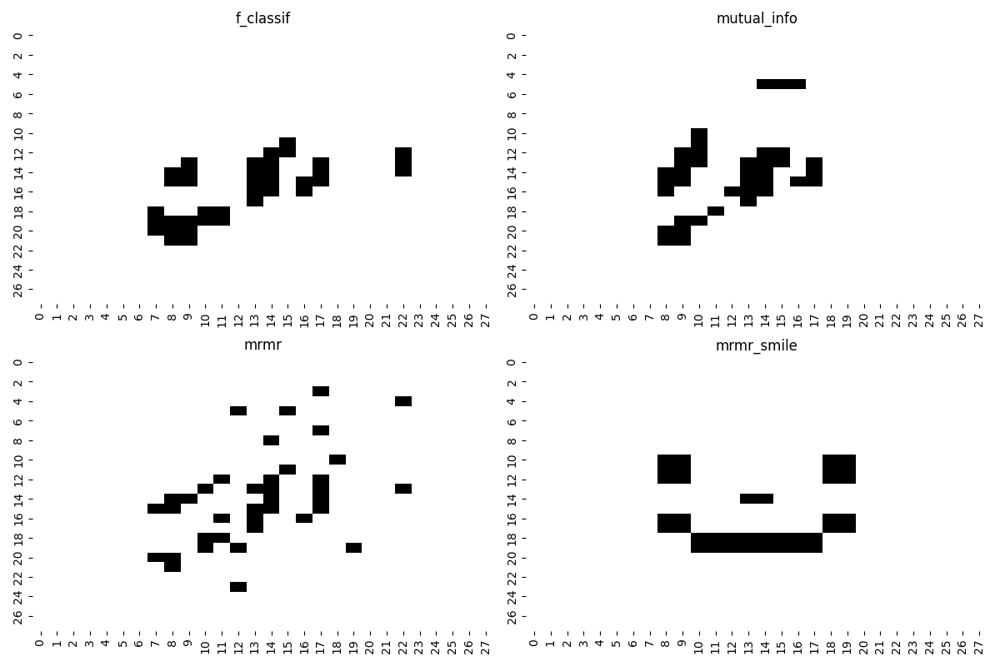

# Feature Selection

Scikit-lego implements a set of feature selection algorithms.

# Maximum Relevance Minimum Redundancy
The [`Maximum Relevance Minimum Redundancy`][MaximumRelevanceMinimumRedundancy-api] can help selecting a sub-set of relevant features from all the features available for a machine learning task.

Maximum Relevance Minimum Redundancy (MRMR) is an iterative feature selection method commonly used in data science to select a subset of features from a larger feature set. The goal of MRMR is to choose features that have high relevance to the target variable while minimizing redundancy among the already selected features.

MRMR is heavily dependent on the two functions used to determine relevace and redundancy. However, from article [Maximum Relevanceand Minimum Redundancy Feature Selection Methods for a Marketing Machine Learning Platform](https://arxiv.org/pdf/1908.05376.pdf) it is proved that using [f_classif](https://scikit-learn.org/stable/modules/generated/sklearn.feature_selection.f_classif.html) or [f_regression](https://scikit-learn.org/stable/modules/generated/sklearn.feature_selection.f_regression.html) as relevance function and Pearson correlation as redundancy function is the best choice for a variety of different problems and in general is a good choice.

Following the article [Feature Selection: How To Throw Away 95% of Your Data and Get 95% Accuracy](https://towardsdatascience.com/feature-selection-how-to-throw-away-95-of-your-data-and-get-95-accuracy-ad41ca016877) by Samuele Mazzanti on Medium we demonstrate a pratical application using the well known mnist dataset.

For the following guide, we will compare this list of  well known filters method:

- F statistical test ([ANOVA F-test](https://scikit-learn.org/stable/modules/generated/sklearn.feature_selection.f_classif.html)).
- Mutual information approximation based on sklearn implementation.

Against the default scikit-lego MRMR implementation and a custom MRMR implementation aimed to select features in order to draw a smiling face on the plot showing the minst letters.

??? example "MRMR imports"
    ```py
    --8<-- "docs/_scripts/feature-selection.py:mrmr-commonimports"
    ```

```py title="MRMR mnist"
--8<-- "docs/_scripts/feature-selection.py:mrmr-intro"
```
After the execution it is possible to inspect the F1-score for the selected features:

```py title="MRMR mnist selected features"
--8<-- "docs/_scripts/feature-selection.py:mrmr-selected-features"
```
```console
Feature selection method: f_classif
0.854
Feature selection method: mutual_info
0.879
Feature selection method: mrmr
0.925
Feature selection method: mrmr_smile
0.849
```
As expected MRMR feature selection model provides better results compared against the other methods. (Smile still performs very well!)

Finally, we can take a look at the selected features.
??? example "MRMR generate plots"
    ```py
    --8<-- "docs/_scripts/feature-selection.py:mrmr-plots"
    ```



[MaximumRelevanceMinimumRedundancy-api]: ../../api/feature-selection#sklego.feature_selection.mrmr.MaximumRelevanceMinimumRedundancy
