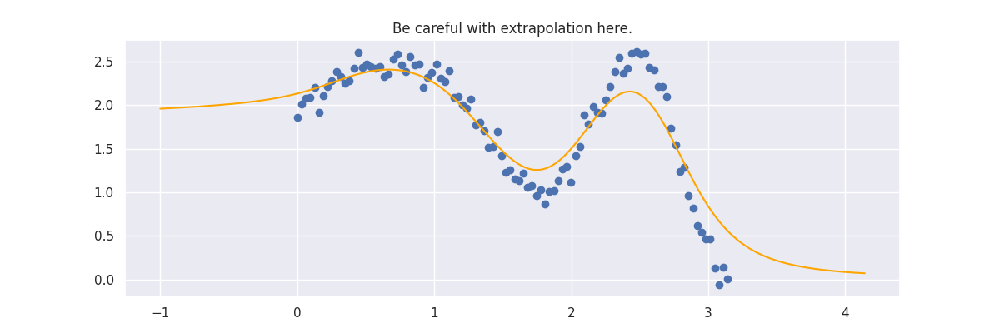
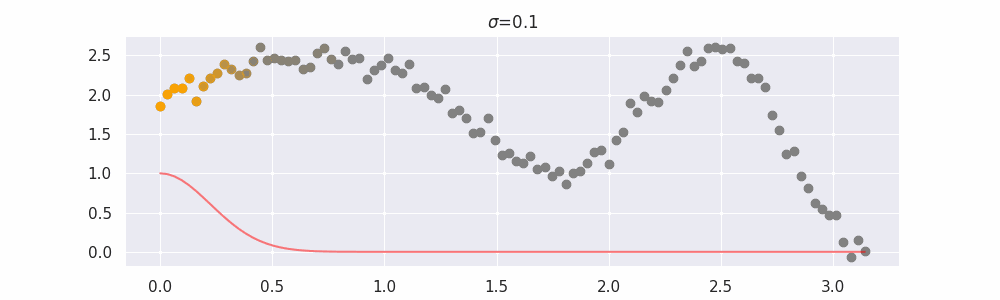
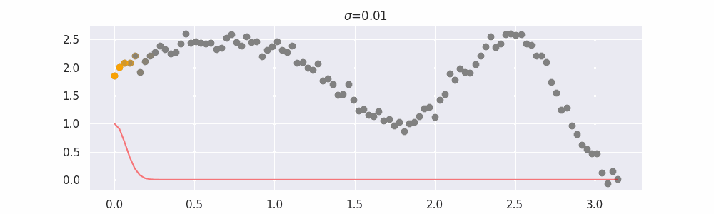
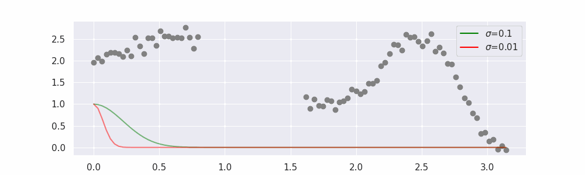
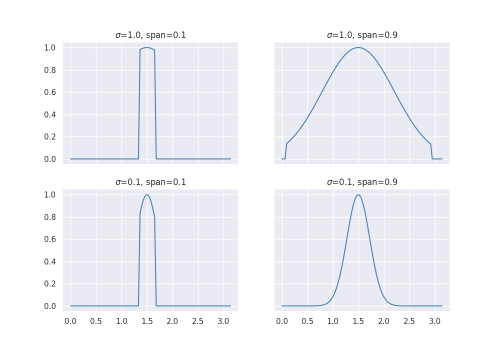
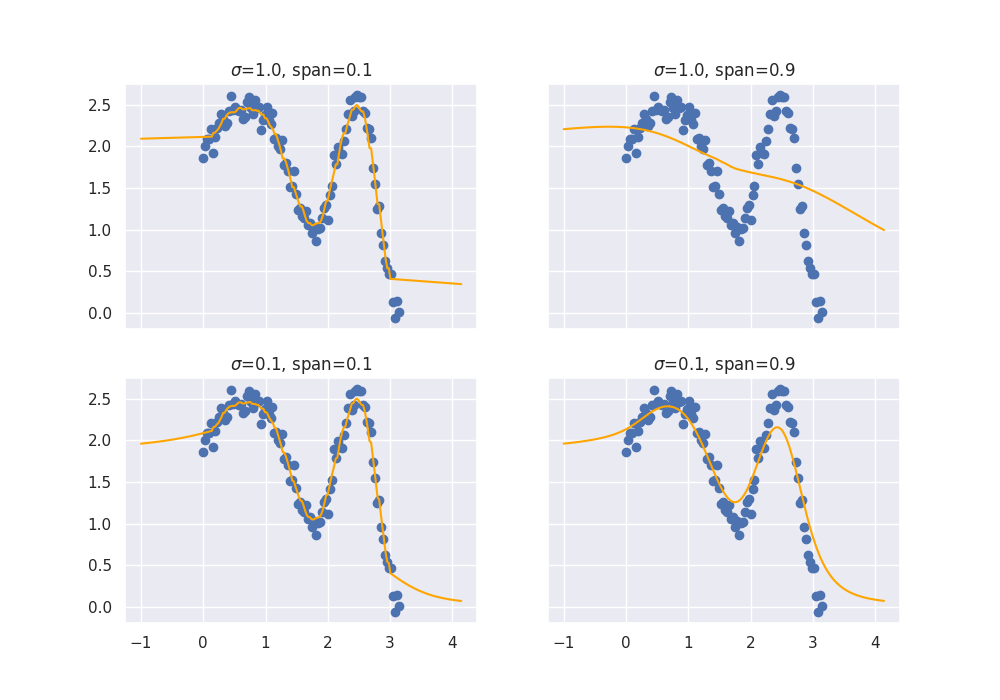
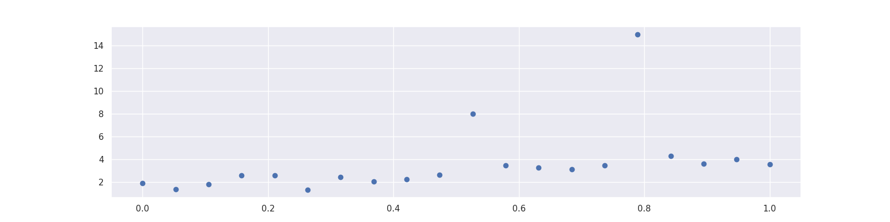
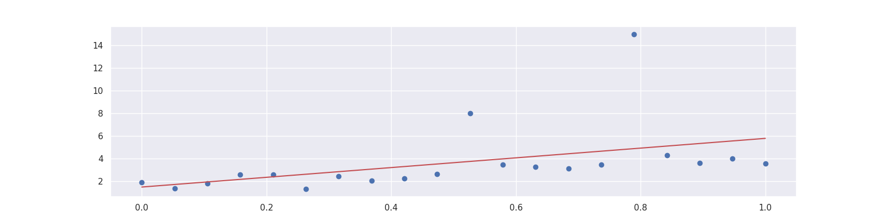
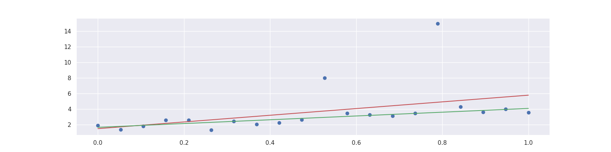
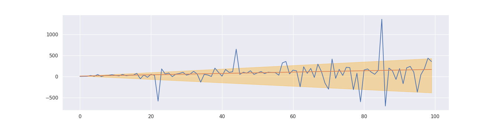

# Linear Models

There's a few linear models out there that we felt were generally useful. This document will highlight some of them.

??? example "Common imports"
    ```py
    --8<-- "docs/_scripts/linear-models.py:common-imports"
    ```

## LOWESS

Lowess stands for LOcally WEighted Scatterplot Smoothing and has historically been used for smoothing but you can also use it for machine learning where you're interested in interpolating. Here's a demo of [`LowessRegression`][lowess-api] in action:

```py title="LowessRegression"
--8<-- "docs/_scripts/linear-models.py:lowess"
```

??? example "Code for plot generation"
    ```py
    --8<-- "docs/_scripts/linear-models.py:plot-lowess"
    ```



The line does not look linear but that's because internally, during prediction, many weighted linear regressions are happening. The gif below demonstrates how the data is being weighted when we would make a prediction.



### Details on `sigma`

We'll also show two different prediction outcomes depending on the hyperparameter `sigma`:




You may be tempted now to think that a lower sigma always has a better fit, but you need to be careful here.
The data might have gaps and larger sigma values will be able to properly regularize.



Note that this regression also works in higher dimensions but the main downside of this approach is that it is _really slow_ when making predictions.

If you want to get advanced there's also a hyperparameter `span` but you'll really need to know what you're doing.
It was added for completeness but the authors of this package have yet to find a proper usecase for it.

### Details on `span`

The `span` parameter can be used to force that you'll only include a certain percentage of your dataset.
Technically without a `span` you are still using all the data in your dataset, albeit with small weights if they are far
away.

The effect of the `span` parameter on the weights can be seen below:



This will also effect the predictions.



You may need to squint your eyes a bit to see it, but lower spans cause more jiggles and less smooth curves.

## ProbWeightRegression

> Note, this is a somewhat experimental feature. We found this feature to be plausibly useful but we've not seen it cause a big "win" yet.

Let's say that you're interested in combining a few models for a regression task.

You could put them together in an ensemble. Say we've got predictions $y_1, y_2, y_3$, each of which come from respectable models, then you may want to combine these together in another linear regression.

This way the new, hopefully best, prediction $y_*$ is defined via:

$$ y^* = w_1 y_1 + w_2 y_2 + w_3 y_3 $$

This can be a valid way of reweighing. But there's one issue: technically the weights $w_1, w_2, w_3$ can sum to a number that isn't one. Since that's numerically totally possible we need to be aware that we can end up in a strange situation.

The [`ProbWeightRegression`][prob-weight-api] addresses this by assuming that every input it receives is the output of a model and it will ensure that they are reweighed with a constraint in mind. For this usecase, it would optimise:

$$
\begin{split}
\text{minimize} & \sum_i (y_i - (w_1 y_{1,i} + w_2 y_{2,i} + w_3 y_{3,i}))^2 \\
\text{subject to} & \\
& \text{ } w_1 + w_2 + w_3 = 1 \\
& \text{ } w_1 \geq 0, w_2 \geq 0, w_3 \geq 0
\end{split}
$$

The final positivity constraint is optional in our model.

Here's an example usage of [`ProbWeightRegression`][prob-weight-api] in action:

```py
--8<-- "docs/_scripts/linear-models.py:prob-weight-data"
```

We've turned the array into a dataframe so that we can apply the [`ColumnSelector`][column-selector-api].

```py title="ProbWeightRegression"
--8<-- "docs/_scripts/linear-models.py:prob-weight-regr"
```

```py
--8<-- "docs/_scripts/linear-models.py:prob-weight-display"
```

--8<-- "docs/_static/linear-models/grid.html"

You can see that the `ProbWeightRegression` indeed sums to one.

```py
--8<-- "docs/_scripts/linear-models.py:prob-weight-coefs"
```

## Least Absolute Deviation Regression

Imagine that you have a dataset with some outliers.

```py title="Data with outliers"
--8<-- "docs/_scripts/linear-models.py:lad-data"
```



A simple linear regression will not do a good job since it is distracted by the outliers. That is because it optimizes the mean squared error

$$ \sum_i \left(y_i-\textrm{model}(x_i)\right)^2 $$

which penalizes a few large errors more than many tiny errors. For example, if $y-\text{model}(x) = 4$ for some single observation, the MSE here is 16. If there are two observations with $y_1 - \text{model}(x_1) = 2$ and $y_2 - \text{model}(x_2) = 2$, the MSE is 8 in total, which is less than for one larger error.

Note that the sum of the errors is the same in both cases.

Hence, linear regression does the following:

```py title="LinearRegression fit"
--8<-- "docs/_scripts/linear-models.py:lr-fit"
```



By changing the loss function to the mean absolute deviation

$$ \sum_i \left|y_i-\textrm{model}(x_i)\right|\enspace$$

we can let the model put the same focus on each error.

This yields the **Least Absolute Deviation** regression that tries to agree with the majority of the points.

Here an example of [LADRegression][lad-api] in action:

```py title="LADRegression fit"
--8<-- "docs/_scripts/linear-models.py:lad-fit"
```



### See also

scikit-learn tackles this problem by offering a variety of [robust regressors](https://scikit-learn.org/stable/auto_examples/linear_model/plot_robust_fit.html). Many of them use an indirect approach to reduce the effect of outliers. [RANSAC](https://en.wikipedia.org/wiki/Random_sample_consensus), for example, samples random points from the dataset until it consists of all inliers.

The closest thing to LADRegression that scikit-learn offers is the [HuberRegressor](https://scikit-learn.org/stable/modules/generated/sklearn.linear_model.HuberRegressor.html) with a loss function that is partly a squared and partly an absolute error. However, it is more complicated and requires hyperparameter tuning to unleash its full potential.

## QuantileRegression

This is an extension of the LADRegression (see above). While the LADRegression outputs a line that over- and underestimates around 50% of the data, the [QuantileRegression][quantile-api] yields lines with different over- and underestimation shares. This can be used for creating simple confidence intervals around predictions. As an example, consider the following:

1. Create a QuantileRegression with quantile=0.1,
2. create a QuantileRegression with quantile=0.9,

then around 80% of the data is between these two lines.

```py title="QuantileRegression fit"
--8<-- "docs/_scripts/linear-models.py:quantile-fit"
```



[lowess-api]: ../../api/linear-model#sklego.linear_model.LowessRegression
[prob-weight-api]: ../../api/linear-model#sklego.linear_model.ProbWeightRegression
[column-selector-api]: ../../api/preprocessing#sklego.preprocessing.ColumnSelector
[lad-api]: ../../api/linear-model#sklego.linear_model.LADRegression
[quantile-api]: ../../api/linear-model#sklego.linear_model.QuantileRegression
