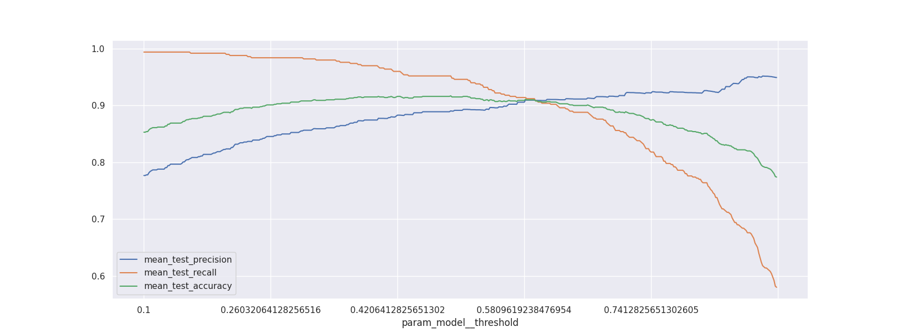
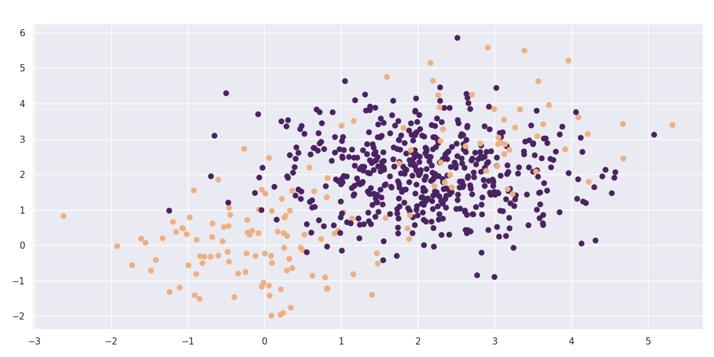

# Meta Models

Certain models in scikit-lego are _meta_. Meta models are models that depend on other estimators that go in and these models will add features to the input model.

One way of thinking of a meta model is to consider it to be a way to _decorate_ a model.

This part of the documentation will highlight a few of them.

## Thresholder

The [`Thresholder`][thresholder-api] can help tweak recall and precision of a model by moving the threshold value of `predict_proba`.

Commonly this threshold is set at 0.5 for two classes. This meta-model can decorate/wrap an estimator with two classes such that the threshold moves.

We demonstrate how that works below. First we'll import the necessary libraries and generate a skewed dataset.

```py title="Skewed dataset"
--8<-- "docs/_scripts/meta-models.py:skewed-data"
```


Next we'll make a cross validation pipeline to try out this thresholder.

```py title="Cross validation pipeline"
--8<-- "docs/_scripts/meta-models.py:cross-validation"
```

```console
CPU times: user 15.4 s, sys: 63.3 ms, total: 15.4 s
Wall time: 15.4 s
```

With this cross validation trained, we'll make a chart to show the effect of changing the threshold value.

```py title="Threshold chart"
--8<-- "docs/_scripts/meta-models.py:threshold-chart"
```



Increasing the threshold will increase the precision but as expected this is at the cost of recall (and accuracy).

### Saving Compute

Technically, you may not need to refit the underlying model that the [`Thresholder`][thresholder-api] model wraps around.

In those situations you can set the `refit` parameter to `False`. If you've got a predefined single model and you're only interested in tuning the cutoff this might make everything run a whole lot faster.

```py title="Cross validation pipeline - no refit"
--8<-- "docs/_scripts/meta-models.py:cross-validation-no-refit"
```

```console
CPU times: user 918 ms, sys: 0 ns, total: 918 ms
Wall time: 917 ms
```

## Grouped Prediction

<p align="center">
  
</p>

To help explain what it can do we'll consider three methods to predict the chicken weight.

The chicken data has 578 rows and 4 columns from an experiment on the effect of diet on early growth of chicks.
The body weights of the chicks were measured at birth and every second day thereafter until day 20. They were also measured on day 21.
There were four groups on chicks on different protein diets.

### Setup

Let's first load a bunch of things to do this.

```py title="Setup"
--8<-- "docs/_scripts/meta-models.py:grouped-predictor-setup"
```

This code will be used to explain the steps below.

### Model 1: Linear Regression with Dummies

First we start with a baseline. We'll use a linear regression and add dummies for the `diet` column.

```py title="Baseline model"
--8<-- "docs/_scripts/meta-models.py:baseline-model"
```


Because the model is linear the dummy variable causes the intercept to change but leaves the gradient untouched. This might not be what we want from a model.

So let's see how the grouped model can address this.

### Model 2: Linear Regression in GroupedPredictor

The goal of the [GroupedPredictor][grouped-predictor-api] is to allow us to split up our data.

The image below demonstrates what will happen.


We train 5 models in total because the model will also train a fallback automatically (you can turn this off via `use_fallback=False`).

The idea behind the fallback is that we can predict something if there is a group at prediction time which is unseen during training.

Each model will accept features that are in `X` that are not part of the grouping variables. In this case each group will model based on the `time` since `weight` is what we're trying to predict.

Applying this model to the dataframe is easy.

```py title="GroupedPredictor model"
--8<-- "docs/_scripts/meta-models.py:grouped-model"
```


Such model looks a bit better.

### Model 3: Dummy Regression in GroupedEstimation

We could go a step further and train a [DummyRegressor][dummy-regressor-api] per diet per timestep.

The code below works similar as the previous example but one difference is that the grouped model does not receive a dataframe but a numpy array.


Note that we're also grouping over more than one column here.
The code that does this is listed below.

```py title="GroupedEstimator with DummyRegressor"
--8<-- "docs/_scripts/meta-models.py:grouped-dummy-model"
```


Note that these predictions seems to yield the lowest error but take it with a grain of salt since these errors are only based on the train set.

## Grouped Transformation

We can apply grouped prediction on estimators that have a `.predict()` implemented but we're also able to do something similar for transformers, like `StandardScaler`.

```py title="Load penguins"
--8<-- "docs/_scripts/meta-models.py:penguins"
```

--8<-- "docs/_static/meta-models/penguins.md"

Let's say that we're interested in scaling the numeric data in this dataframe. If we apply a normal [`StandardScaler`][standard-scaler-api] then we'll likely get clusters appear for all the `species` and for the `sex`. It may be the case (for fairness reasons) that we don"t mind the clusters based on `species` but that we _do_ mind the clusters based on `sex`.

In these scenarios the [`GroupedTransformer`][grouped-transformer-api] can help out. We can specify a grouping column that the data needs to be split on before the transformation is applied.

```py title="GroupedTransformer"
--8<-- "docs/_scripts/meta-models.py:grouped-transform"
```


??? example "Code for plotting the transformed data"
    ```py
    --8<-- "docs/_scripts/meta-models.py:grouped-transform-plot"
    ```

You can see that there are certainly still clusters. These are caused by the fact that there's different `species` of penguin in our dataset. However you can see that when we apply our `GroupedTransformer` that we're suddenly able to normalise towards `sex` as well.

### Other scenarios

This transformer also has use-cases beyond fairness. You could use this transformer to causally compensate for subgroups in your data.

For example, for predicting house prices, using the surface of a house relatively to houses in the same neighborhood could be a more relevant feature than the surface relative to all houses.

## Decayed Estimation

Often you are interested in predicting the future. You use the data from the past in an attempt to achieve this and it  could be said that perhaps data from the far history is less relevant than data from the recent past.

This is the idea behind the [`DecayEstimator`][decay-api] meta-model. It looks at the order of data going in and it will assign a higher importance to recent rows that occurred recently and a lower importance to older rows.

Recency is based on the order so it is important that the dataset that you pass in is correctly ordered beforehand.

we'll demonstrate how it works by applying it on a simulated timeseries problem.

```py title="TimeSeries data"
--8<-- "docs/_scripts/meta-models.py:ts-data"
```


We will create two models on this dataset. One model calculates the average value per month in our timeseries and the other does the same thing but will decay the importance of making accurate predictions for the far history.

```py title="DecayEstimator"
--8<-- "docs/_scripts/meta-models.py:decay-model"
```


The decay parameter has a lot of influence on the effect of the model but one can clearly see that we shift focus to the more recent data.

### Decay Functions

scikit-lego provides a set of decay functions that can be used to decay the importance of older data. The default decay function used in `DecayEstimator` is the `exponential_decay` function (`decay_func="exponential"`).

Out of the box there are four decay functions available:


??? example "Code for plotting the decay functions"
    ```py
    --8<-- "docs/_scripts/meta-models.py:decay-functions"
    ```

The arguments of these functions can be passed along to the `DecayEstimator` class as keyword arguments:

```py
DecayEstimator(..., decay_func="linear", min_value=0.5)
```

To see which keyword arguments are available for each decay function, please refer to the [Decay Functions API section][decay-functions].

Notice that passing a string to refer to the built-in decays is just a convenience.

Therefore it is also possible to create a custom decay function and pass it along to the `DecayEstimator` class, **as long as** the first two arguments of the function are `X` and `y` and the return shape is the same as `y`:

```py title="Custom decay function"
def custom_decay(X, y, alpha, beta, gamma):
    """My custom decay function where the magic happens"""
    ...
    return decay_values

DecayEstimator(...,
    decay_func=custom_decay,
    alpha=some_alpha, beta=some_beta, gamma=some_gamma
)
```

## Confusion Balancer

!!! warning "Disclaimer"
    This feature is an experimental.

We added the [`ConfusionBalancer`][confusion-balancer-api] as experimental feature to the meta estimators that can be used to force balance in the confusion matrix of an estimator. Consider the following dataset:

??? example "Make blobs"
    ```py
    --8<-- "docs/_scripts/meta-models.py:make-blobs"
    ```



Let's take this dataset and train a simple classifier against it.

```py
--8<-- "docs/_scripts/meta-models.py:simple-classifier"
```

The confusion matrix is not ideal. This is in part because the dataset is slightly imbalanced but in general it is also because of the way the algorithm works.

Let's see if we can learn something else from this confusion matrix. We might transform the counts into probabilities.

```py
--8<-- "docs/_scripts/meta-models.py:normalized-cfm"
```

Let's consider the number 0.1359 in the lower left corner. This number represents the probability that the actually class 0 while the model predicts class 1. In math terms we might write this as $P(C_1 | M_1)$ where $C_i$ denotes the actual label while $M_i$ denotes the label given by the algorithm.

The idea now is that we might rebalance our original predictions $P(M_i)$ by multiplying them;

$$ P_{\text{corrected}}(C_1) = P(C_1|M_0) p(M_0) + P(C_1|M_1) p(M_1) $$

In general this can be written as:

$$ P_{\text{corrected}}(C_i) = \sum_j P(C_i|M_j) p(M_j) $$

In laymens terms; we might be able to use the confusion matrix to learn from our mistakes. By how much we correct is something that we can tune with a hyperparameter.

$$ P_{\text{corrected}}(C_i) = \alpha \sum_j P(C_i|M_j) p(M_j) + (1-\alpha) p(M_j) $$

We'll perform an optimistic demonstration below.

??? example "Help functions"
    ```py
    --8<-- "docs/_scripts/meta-models.py:help-functions"
    ```

```py title="Confusion Balancer"
--8<-- "docs/_scripts/meta-models.py:confusion-balancer"
```


??? example "Code to generate the plot"
    ```py
    --8<-- "docs/_scripts/meta-models.py:confusion-balancer-results"
    ```

It seems that we can pick a value for $\alpha$ such that the confusion matrix is balanced. there's also a modest increase in accuracy for this balancing moment.

It should be emphasized though that this feature is **experimental**. There have been dataset/model combinations where this effect seems to work very well while there have also been situations where this trick does not work at all.

It also deserves mentioning that there might be alternative to your problem. If your dataset is suffering from a huge class imbalance then you might be better off by having a look at the [imbalanced-learn][imb-learn] project.

## Zero-Inflated Regressor

There are regression datasets that contain an unusually high amount of zeroes as the targets.

This can be the case if you want to predict a count of rare events, such as defects in manufacturing, the amount of some natural disasters or the amount of crimes in some neighborhood.

Usually nothing happens, meaning the target count is zero, but sometimes we actually have to do some modelling work.

The classical machine learning algorithms can have a hard time dealing with such datasets.

Take linear regression for example: the chance of outputting an actual zero is diminishing.

Sure, you can get regions where you are close to zero, but modelling an output of **exactly zero** is infeasible in  general. The same goes for neural networks.

What we can do circumvent these problems is the following:

1. Train a classifier to tell us whether the target is zero, or not.
2. Train a regressor on all samples with a non-zero target.

By putting these two together in an obvious way, we get the [`ZeroInflatedRegressor`][zero-inflated-api]. You can use it like this:

```py title="ZeroInflatedRegressor"
--8<-- "docs/_scripts/meta-models.py:zero-inflated"
```

```console
ZIR (RFC+RFR) r²: 0.8992404366385873
RFR r²: 0.8516522752031502
```

## Outlier Classifier

Outlier models are unsupervised so they don't have `predict_proba` or `score` methods.

In case you have some labelled samples of which you know they should be outliers,
it could be useful to calculate metrics as if the outlier model was a classifier.

Moreover, if outlier models had a `predict_proba` method, you could use a classification model combined with an outlier detection model in a [`StackingClassifier`][stacking-classifier-api] and take advantage of probability outputs of both categories of models.

To this end, the [`OutlierClassifier`][outlier-classifier-api] turns an outlier model into a classification model.

A field of application is fraud: when building a model to detect fraud, you often have _some_ labelled positives but you know there should be more, even in your train data.

If you only use anomaly detection, you don't make use of the information in your labelled data set. If you only use a classifier, you might have insufficient data to do proper train-test splitting and perform hyperparameter optimization.

Therefore one could combine the two approaches as shown below to get the best of both worlds.

In this example, we change the outlier model `IsolationForest` into a classifier using the `OutlierClassifier`. We create a random dataset with 1% outliers.

```py title="OutlierClassifier"
--8<-- "docs/_scripts/meta-models.py:outlier-classifier"
```

--8<-- "docs/_static/meta-models/outlier-classifier.html"

Anomaly detection algorithms in scikit-Learn return values `-1` for inliers and `1` for outliers.

As you can see, the `OutlierClassifier` predicts inliers as `0` and outliers as `1`:

```py title="OutlierClassifier output"
--8<-- "docs/_scripts/meta-models.py:outlier-classifier-output"
```

```console
inlier:  [0.]
outlier:  [1.]
```

The `predict_proba` method returns probabilities for both classes (inlier, outlier):

```py title="OutlierClassifier predict_proba"
--8<-- "docs/_scripts/meta-models.py:outlier-classifier-proba"
```

> array([[0.0376881, 0.9623119]])

The `OutlierClassifier` can be combined with any classification model in the `StackingClassifier` as follows:

```py title="Stacking OutlierClassifier"
--8<-- "docs/_scripts/meta-models.py:outlier-classifier-stacking"
```

--8<-- "docs/_static/meta-models/outlier-classifier-stacking.html"

## Ordinal Classification

Ordinal classification (sometimes also referred to as Ordinal Refression) involves predicting an ordinal target variable, where the classes have a meaningful order.
Examples of this kind of problem are: predicting customer satisfaction on a scale from 1 to 5, predicting the severity of a disease, predicting the quality of a product, etc.

The [`OrdinalClassifier`][ordinal-classifier-api] is a meta-model that can be used to transform any classifier into an ordinal classifier by fitting N-1 binary classifiers, each handling a specific class boundary, namely: $P(y <= 1), P(y <= 2), ..., P(y <= N-1)$.

This implementation is based on the paper [A simple approach to ordinal classification][ordinal-classification-paper] and it allows to predict the ordinal probabilities of each sample belonging to a particular class.

!!! note "mord library"
    If you are looking for a library that implements other ordinal classification algorithms, you can have a look at the [mord][mord] library.

```py title="Ordinal Data"
--8<-- "docs/_scripts/meta-models.py:ordinal-classifier-data"
```

--8<-- "docs/_static/meta-models/ordinal_data.md"

Description of the dataset from [statsmodels tutorial][statsmodels-ordinal-regression]:

> This dataset is about the probability for undergraduate students to apply to graduate school given three exogenous variables:
>
> - their grade point average (`gpa`), a float between 0 and 4.
> - `pared`, a binary that indicates if at least one parent went to graduate school.
> - `public`, a binary that indicates if the current undergraduate institution of the student is > public or private.
>
> `apply`, the target variable is categorical with ordered categories: "unlikely" < "somewhat likely" < "very likely".
>
> [...]
>
> For more details see the the Documentation of OrderedModel, [the UCLA webpage][ucla-webpage].

The only transformation we are applying to the data is to convert the target variable to an ordinal categorical variable by mapping the ordered categories to integers using their (pandas) category codes.

We are now ready to train a [`OrdinalClassifier`][ordinal-classifier-api] on this dataset:

```py title="OrdinalClassifier"
--8<-- "docs/_scripts/meta-models.py:ordinal-classifier"
```

> [[0.54883853 0.36225347 0.088908]]

### Probability Calibration

The `OrdinalClassifier` emphasizes the importance of proper probability estimates for its functionality. It is recommended to use the [`CalibratedClassifierCV`][calibrated-classifier-api] class from scikit-learn to calibrate the probabilities of the binary classifiers.

Probability calibration is _not_ enabled by default, but we provide a convenient keyword argument `use_calibration` to enable it as follows:

```py title="OrdinalClassifier with probability calibration"
--8<-- "docs/_scripts/meta-models.py:ordinal-classifier-with-calibration"
```

### Computation Time

As a meta-estimator, the `OrdinalClassifier` fits N-1 binary classifiers, which may be computationally expensive, especially with a large number of samples, features, or a complex classifier.

[thresholder-api]: ../../api/meta#sklego.meta.thresholder.Thresholder
[grouped-predictor-api]: ../../api/meta#sklego.meta.grouped_predictor.GroupedPredictor
[grouped-transformer-api]: ../../api/meta#sklego.meta.grouped_transformer.GroupedTransformer
[decay-api]: ../../api/meta#sklego.meta.decay_estimator.DecayEstimator
[decay-functions]: ../../api/decay-functions
[confusion-balancer-api]: ../../api/meta#sklego.meta.confusion_balancer.ConfusionBalancer
[zero-inflated-api]: ../../api/meta#sklego.meta.zero_inflated_regressor.ZeroInflatedRegressor
[outlier-classifier-api]: ../../api/meta#sklego.meta.outlier_classifier.OutlierClassifier
[ordinal-classifier-api]: ../../api/meta#sklego.meta.ordinal_classification.OrdinalClassifier

[standard-scaler-api]: https://scikit-learn.org/stable/modules/generated/sklearn.preprocessing.StandardScaler.html
[stacking-classifier-api]: https://scikit-learn.org/stable/modules/generated/sklearn.ensemble.StackingClassifier.html#sklearn.ensemble.StackingClassifier
[dummy-regressor-api]: https://scikit-learn.org/stable/modules/generated/sklearn.dummy.DummyRegressor.html
[imb-learn]: https://imbalanced-learn.org/stable/
[ordinal-classification-paper]: https://www.cs.waikato.ac.nz/~eibe/pubs/ordinal_tech_report.pdf
[mord]: https://pythonhosted.org/mord/
[statsmodels-ordinal-regression]: https://www.statsmodels.org/dev/examples/notebooks/generated/ordinal_regression.html
[ucla-webpage]: https://stats.oarc.ucla.edu/r/dae/ordinal-logistic-regression/
[calibrated-classifier-api]: https://scikit-learn.org/stable/modules/generated/sklearn.calibration.CalibratedClassifierCV.html
