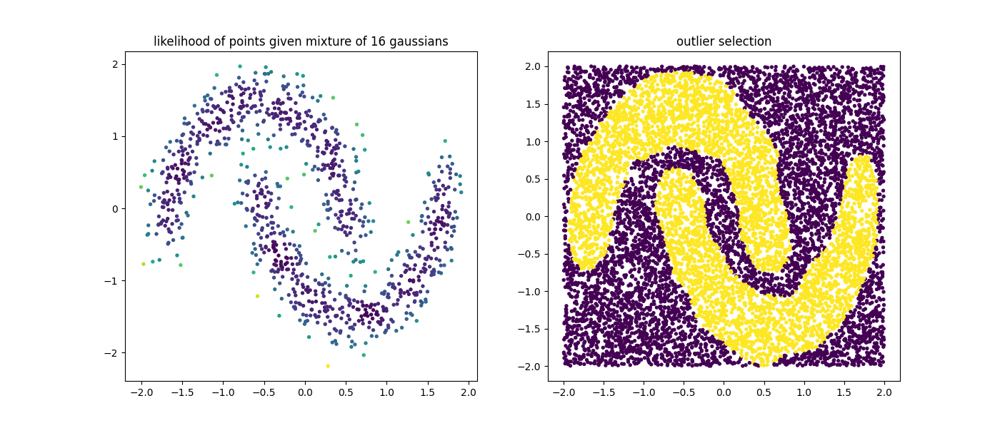

# Mixture Methods

Gaussian Mixture Models (GMMs) are flexible building blocks for other machine learning algorithms.

This is in part because they are great approximations for general probability distributions but also because they remain somewhat interpretable even when the dataset gets very complex.

This package makes use of GMMs to construct other algorithms. In addition to the [GMMClassifier][gmm-classifier-api] and [GMMDetector][gmm-classifier-api], this library also features a [BayesianGMMClassifier][bayes_gmm-classifier-api] and [BayesianGMMDetector][bayes_gmm-outlier-detector-api] as well. These methods offer pretty much the same API, but will have internal methods to figure out what number of components to estimate. These methods tend to take significantly more time to train, so alternatively you may also try doing a proper grid search to figure out the best number of components for your use-case. 

## Classification

Below is some example code of how you might use a [GMMClassifier][gmm-classifier-api] from sklego to perform classification.

```py title="GMMClassifier"
--8<-- "docs/_scripts/mixture-methods.py:gmm-classifier"
```


## Outlier Detection

Below is some example code of how you might use a GMM from sklego to do outlier detection.

Note that the [GMMOutlierDetector][gmm-outlier-detector-api] generates prediction values that are either -1 (outlier) or +1 (normal).

```py title="GMMOutlierDetector"
--8<-- "docs/_scripts/mixture-methods.py:gmm-outlier-detector"
```



Remark that with a GMM there are multiple ways to select outliers. Instead of selection points that are beyond the likely quantile threshold one can also specify the number of standard deviations away from the most likely standard deviations a given point it.

??? example "Different thresholds"
    ```py
    --8<-- "docs/_scripts/mixture-methods.py:gmm-outlier-multi-threshold"
    ```


### Detection Details

The outlier detection methods that we use are based on the likelihoods that come out of the estimated Gaussian Mixture.

Depending on the setting you choose we have a different method for determining if a point is inside or outside the
threshold.

1. If the `"quantile"` method is used, we take all the likelihood scores found that the GMM associates on a training dataset to determine where to set a threshold. The threshold value must be between 0 and 1 here.
2. If the `"stddev"` method is used, then the threshold value is now interpreted as the number of standard deviations lower than the mean we are. We only calculate the standard deviation on the lower scores because there's usually more variance here.
    !!! note
        This setting allows you to be much more picky in selecting than the `"quantile"` one since this method allows you to be more exclusive than the `"quantile"` method with threshold equal to one.


As a sidenote: this image was generated with some dummy data, but its code can be found below:

!!! example "Code for plot generation"
    ```py
    --8<-- "docs/_scripts/mixture-methods.py:outlier-mixture-threshold"
    ```

[gmm-classifier-api]: ../../api/mixture#sklego.mixture.gmm_classifier.GMMClassifier
[bayes_gmm-classifier-api]: ../../api/mixture#sklego.mixture.bayesian_gmm_classifier.BayesianGMMClassifier
[gmm-outlier-detector-api]: ../../api/mixture#sklego.mixture.gmm_outlier_detector.GMMOutlierDetector
[bayes_gmm-outlier-detector-api]: ../../api/mixture#sklego.mixture.gmm_outlier_detector.BayesianGMMOutlierDetector
