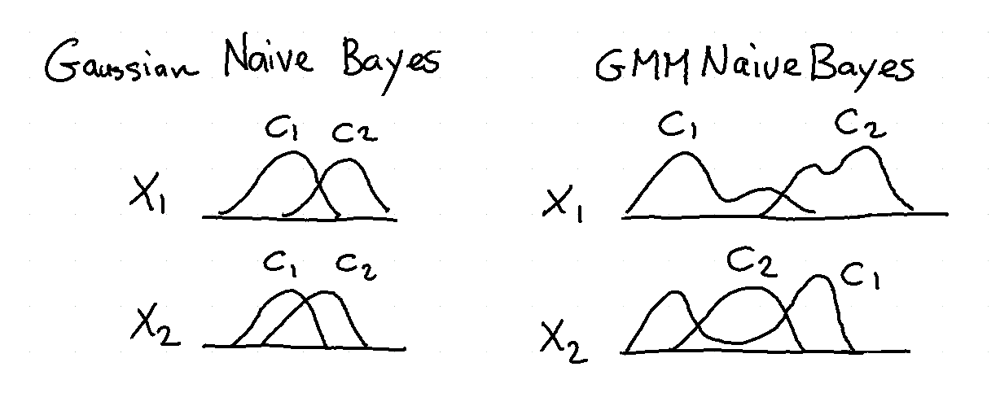
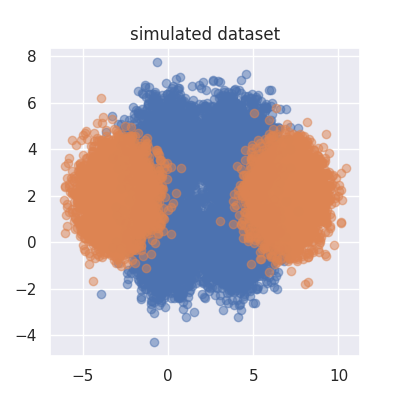
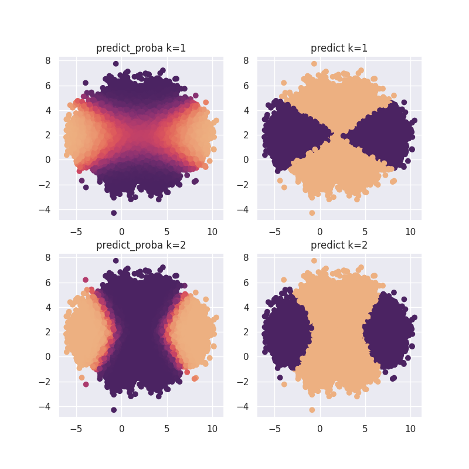
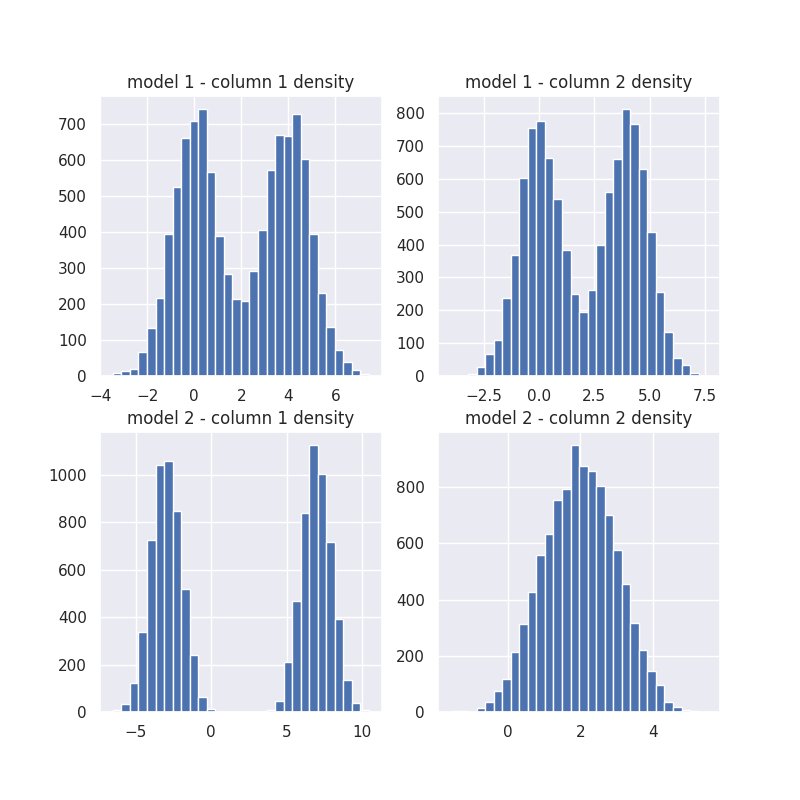

# Naive Bayes

Naive Bayes models are flexible and interpretable. In scikit-lego we've added support for a Gaussian Mixture variant of the algorithm.



An example of the usage of algorithm can be found below.

## Example

Let's first import the dependencies and create some data. This code will create a plot of the dataset we'll try to predict.

```py title="Simulated dataset"
--8<-- "docs/_scripts/naive-bayes.py:simulated-data"
```



Note that this dataset would be hard to classify directly if we would be using a standard Gaussian Naive Bayes algorithm since the orange class is multipeaked over two clusters.

To demonstrate this we'll run our [`GaussianMixtureNB`][gaussian-mix-nb-api] algorithm with one or two gaussians that the mixture is allowed to find.

```py title="GaussianMixtureNB model"
--8<-- "docs/_scripts/naive-bayes.py:model-results"
```



Note that the second plot fits the original much better.

We can even zoom in on this second algorithm by having it sample what it believes is the distribution on each column.

??? example "Model density"
    ```py title="Model density"
    --8<-- "docs/_scripts/naive-bayes.py:model-density"
    ```



[gaussian-mix-nb-api]: ../../api/naive-bayes#sklego.naive_bayes.GaussianMixtureNB
