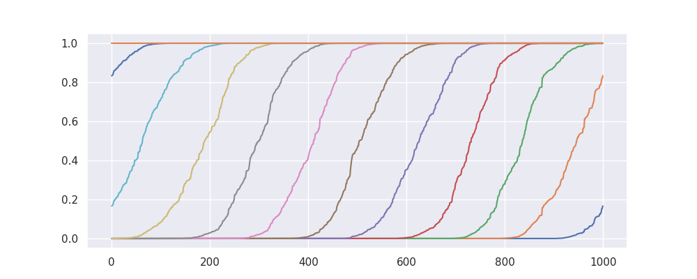
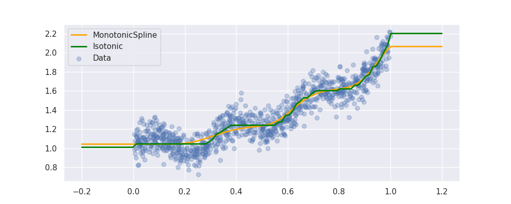

# Preprocessing

There are many preprocessors in scikit-lego and in this document we would like to highlight a few such that you might be inspired to use pipelines a little bit more flexibly.

## Estimators as Transformers

Sometimes you'd like the output of a model to be available as a feature that you might use as input for another model. The issue here is that scikit learn pipelines usually only allow a single model at the end of a pipeline.

One solution to this problem is to turn the model into a transformer. To convert a model to become a transformer you can use the [`EstimatorTransformer`][estimator-transformer-api] from the [`meta`][meta-module] module.

### Example 1

Let's demonstrate one example. Below we describe how to create a pipeline with two models that each see the same dataset. Note that the output of this pipeline is still only a transformer pipeline.


```py
--8<-- "docs/_scripts/preprocessing.py:estimator-transformer-1"
```

```console
array([[1.84239085, 1.8381264 ],
       [1.84487058, 1.84095898],
       [0.78867225, 0.79690879],
       ...,
       [1.92562838, 1.92076151],
       [1.52504886, 1.52524312],
       [0.81791076, 0.82568794]])
```

### Example 2

Here's another example that works a little bit differently. Here we have two models that each see different data.


```py
--8<-- "docs/_scripts/preprocessing.py:estimator-transformer-2"
```

```console
array([[1.3810049 , 1.96265338],
       [1.75182446, 1.5942067 ],
       [1.15431258, 1.13093337],
       ...,
       [1.7719303 , 1.65521752],
       [1.98484405, 1.03984466],
       [1.05164825, 1.26300114]])
```

## Concatenating Pipelines

Transformers in scikit-learn typically do not add features. They replace them. Take `PCA` for example.


The new dataset that comes out $X^{\text{new}}$ would no longer have columns ${x_1,...,x_4}$ but would instead replace them with ${x_{\text{PCA}_1}, x_{\text{PCA}_2}}$.

If we rethink the pipeline a little bit we might not have to loose the original data.


If you don't want to loose data, you can make use of a `FeatureUnion` and a [`IdentityTransformer`][id-transformer-api].

```py
--8<-- "docs/_scripts/preprocessing.py:identity-transformer"
```

You can check below that this pipeline will *concatenate* features without replacing them.

```py
print(np.round(X_new[:3], 4))
```

```console
array([[ 0.3745,  0.9507,  0.732 ,  0.5987,  0.4888, -0.0206],
       [ 0.156 ,  0.156 ,  0.0581,  0.8662, -0.1584,  0.4143],
       [ 0.6011,  0.7081,  0.0206,  0.9699,  0.1228, -0.1769]])
```

```py
print(np.round(X[:3], 4))
```

```console
array([[0.3745, 0.9507, 0.732 , 0.5987],
       [0.156 , 0.156 , 0.0581, 0.8662],
       [0.6011, 0.7081, 0.0206, 0.9699]])
```

## Column Capping

Some models are great at interpolation but less good at extrapolation.

One way to potentially circumvent this problem is by capping extreme values that occur in the dataset $X$.


Let's demonstrate how [`ColumnCapper`][column-capper-api] works in a few examples below.

```py
--8<-- "docs/_scripts/preprocessing.py:column-capper"
```

!!! warning
    Note that the `ColumnCapper`` does not deal with missing values but it does support pandas dataframes as well as infinite values.

    ```py
    --8<-- "docs/_scripts/preprocessing.py:column-capper-inf"
    ```

    ```console
    array([[0.10029693, 0.89859006],
        [0.10029693, 0.89859006]])
    ```

## Formulaic (Wilkinson formulas)

If you're used to the statistical programming language R you might have seen a formula object before. This is an object that represents a shorthand way to design variables used in a statistical model.

The [formulaic][formulaic-docs] python project took this idea and made it available for python. From sklego we've made a wrapper, called [`FormulaicTransformer`][formulaic-api], such that you can also use these in your pipelines.

```py
--8<-- "docs/_scripts/preprocessing.py:formulaic-1"
```

--8<-- "docs/_static/preprocessing/formulaic-1.md"

You might notice that the first column contains the constant array equal to one. You might also expect 3 dummy variable columns instead of 2.

This is because the design matrix from formulaic attempts to keep the columns in the matrix linearly independent of each other.

If this is not something you'd want to create you can choose to omit
it by indicating "-1" in the formula.

```py
--8<-- "docs/_scripts/preprocessing.py:formulaic-2"
```

--8<-- "docs/_static/preprocessing/formulaic-2.md"

You'll notice that now the constant array is gone and it is replaced with a dummy array. Again this is now possible because formulaic wants to guarantee that each column in this matrix is linearly independent of each other.

The formula syntax is pretty powerful, if you'd like to learn we refer you
to [formulas][formulaic-formulas] documentation.

## Repeating Basis Function Transformer

Some variables are of a circular nature. For example, the days of the year, 1-Jan-2019 (day 1) is just as close to 2-Jan-2019 (day 2) as it is to 31-Dec-2018 (day 365).

If you would encode day of year numerically you would lose this information, as 1 close 2 to but far from 365. The [`RepeatingBasisFunction`][rbf-api] transformer can remedy this problem.

The transformer selects a column and transforms it with a given number of repeating (radial) basis functions, which have a bell curve shape. The basis functions are equally spaced over the input range. The key feature of repeating basis functions is that they are continuous when moving from the max to the min of the input range.

As a result these repeating basis functions can capture how close each datapoint is to the center of each repeating basis function, even when the input data has a circular nature.

### Example

Let's make some random data to start with. We have input data `day`, `day_of_year` and target `y`.

```py title="Data"
--8<-- "docs/_scripts/preprocessing.py:rbf-data"
```


Let's now create repeating basis functions based on `day_of_year`:

```py
--8<-- "docs/_scripts/preprocessing.py:rbf-transform"
```

Now let's plot our transformed features:

```py
--8<-- "docs/_scripts/preprocessing.py:rbf-plot"
```


The `day_of_year` feature has been replaced with `N_PERIODS` repeating basis functions.
These are bell curves that are equidistant over the 1-365 range. Each curve captures the information of *being close to* a particular `day_of_year`.

For example, the curve in the top row captures how close a day is to new year's day. It peaks on day 1 with a value of 1 and smoothly drops at an equal rate in December and in the rest of January.

Note, how the `day` feature still exists, in the transformed feature set as a result of the `remainder="passthrough"` setting. The default setting `remainder="drop"` will only keep the repeating basis functions and drop all columns of the original dataset.

### Example Regression

Let's use these features below in a regression.

```py
--8<-- "docs/_scripts/preprocessing.py:rbf-regr"
```


Note that you can make this approach even more powerful for timeseries by choosing to ignore the far away past.

To explore this idea we've also implemented a `DecayEstimator`. For more information see the [section on meta estimators][decay-section] for this.

## Monotonic Spline Transformer

The `MonotonicSplineTransformer` is a transformer that fits a monotonic spline to the input data. This can be useful when you want to capture non-linear relationships between features and the target variable, while ensuring that the relationship is monotonic. The technique is based on [_Fitting monotonic curves using splines_ blogpost by Mate Kadlicsko](https://matekadlicsko.github.io/posts/monotonic-splines/).

To demonstrate how this works let's first generate some data.

```py
--8<-- "docs/_scripts/preprocessing.py:monotonic-spline"
```


Next, let's show what the transformed data looks like.

```py
--8<-- "docs/_scripts/preprocessing.py:monotonic-spline-transform"
```



Finally, let's show how these features might compare with an isotonic regression.

```py
--8<-- "docs/_scripts/preprocessing.py:monotonic-spline-regr"
```



While the `IsotonicRegression` gives a similar result, there are a few reasons why the monotonic spline might be preferred:

1. The monotonic model can result in a smoother model when followed up by a linear model. The linear model can still guarantee monotonicity, but the `IsotonicRegression` might result in a spiky output.
2. When datasets get big, especially when there are many features involved, the monotonic spline might be faster to compute. This is because the `IsotonicRegression` demands a more complex solver that might not scale as well as a linear model.

## Interval Encoders

Sometimes a linear regression doesn't entirely do what you'd like. Take this pattern;

```py
--8<-- "docs/_scripts/preprocessing.py:interval-encoder-1"
```


What we could do though, is preprocess the data such that it *can* be passed to a linear regression. We could construct intervals in the `x` values, smooth with regards to `y` and interpolate in between. You can see a demo of this below using the [`IntervalEncoder`][interval-encoder-api] from sklego.

```py
--8<-- "docs/_scripts/preprocessing.py:interval-encoder-2"
```


Note that we extrapolate using the estimates of the intervals at the edges. This ensures that we can make predictions out of sample.

```py
--8<-- "docs/_scripts/preprocessing.py:interval-encoder-3"
```


### Monotonic Encoding

At the moment this feature is useful because it allows us to encode non-linear relationships. The real power of this approach is that we might apply constraints. We could create features that are strictly monotonic. When such features are passed to a model that respects these constraints then we might prevent artificial stupidity because we can force domain knowledge to be taken into account.

Let's first define a function that helps us generate multiple datasets.

```py
--8<-- "docs/_scripts/preprocessing.py:monotonic-1"
```

Now that this is in there, let's first show the behavior of the `method="average"` and `method="normal"` settings.

```py
--8<-- "docs/_scripts/preprocessing.py:monotonic-2"
```


Now let's see what occurs when we add a constraint that enforces the feature to only be `method="increasing"` or `method="decreasing"`.

```py
--8<-- "docs/_scripts/preprocessing.py:monotonic-3"
```


If these features are now passed to a model that supports monotonicity constraints then we can build models with guarantees.

## Outlier Removal

The [`OutlierRemover`][outlier-remover-api] class is a transformer that removes outliers from your dataset during training time only based on some outlier detector estimator. This can be useful in scenarios where outliers in the training data can negatively impact the performance of your model. By removing these outliers during training, your model can learn from a "clean" dataset that may lead to better performance.

It's important to note that this transformer only removes outliers during training. This means that when you use your trained model to predict on new data, the new data will not have any outliers removed. This is useful because in a real-world scenario, new data may contain outliers and you would want your model to be able to handle these cases.

The `OutlierRemover` class is initialized with an `outlier_detector` estimator, and a boolean flag `refit`. The outlier detector should be a scikit-learn compatible estimator that implements `.fit()` and `.predict()` methods. The refit flag determines whether the underlying estimator is fitted during `OutlierRemover.fit()`.

[estimator-transformer-api]: ../../api/meta#sklego.meta.estimator_transformer.EstimatorTransformer
[meta-module]: ../../api/meta
[id-transformer-api]: ../../api/preprocessing#sklego.preprocessing.identitytransformer.IdentityTransformer
[column-capper-api]: ../../api/preprocessing#sklego.preprocessing.columncapper.ColumnCapper
[formulaic-api]: ../../api/preprocessing#sklego.preprocessing.formulaictransformer.FormulaicTransformer
[rbf-api]: ../../api/preprocessing#sklego.preprocessing.repeatingbasis.RepeatingBasisFunction
[interval-encoder-api]: ../../api/preprocessing#sklego.preprocessing.intervalencoder.IntervalEncoder
[decay-section]: ../../user-guide/meta#decayed-estimation
[outlier-remover-api]: ../../api/preprocessing#sklego.preprocessing.outlier_remover.OutlierRemover

[formulaic-docs]: https://matthewwardrop.github.io/formulaic/
[formulaic-formulas]: https://matthewwardrop.github.io/formulaic/formulas/
